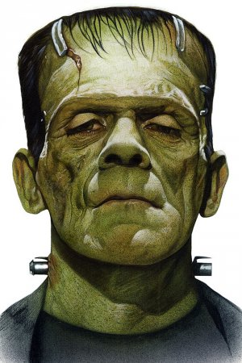

# CU STAT GU4243 Applied Data Science Spring 2018
# Project 1: Spooky Dataset Analysis
# Author: Daniel Joseph Parker

## About this project

### This document

I wrote this project summary aimed at a general audience. People without coding and math experience should be able to make sense of it!

### Scope

What's the scope of this *terrifying* project?

We're going to try to figure out as much as we can about the **writing styles** of a group of three English-language authors known for writing in the horror genre. 

The three authors are:
1. Mary Wollstonecraft Shelley,
2. H. P. Lovecraft, and 
3. Edgar Allen Poe.

The data we'll use originally come from a Kaggle dataset we'll refer to as the "Spooky Dataset." This was generated as part of a [competition](https://www.kaggle.com/c/spooky-author-identification) that happened in late 2017.

### Motivation

Why is this project important, and what applications might it have, taken far enough? 

Imagine if we were able to find out enough about the writing styles of a group of authors to be to figure out who wrote a given sentence *just* by looking at the text of sentence -- not even needing to read what paragraph it came from, not looking to see when it was written or what book it was part of, and so forth.

The implications for humanistic scholarship of being able to do *authorship attribution* are obviously immense. There are many other business and public sector contexts, as well, in which determining the unknown author of a document would be helpful.

While the original Kaggle competition involved building an author predictor, we don't do that here. In a way, this project is the *preliminary* work before that stage.

### Methods

In order to do go about this exploration, we'll use `R` to explore some natural language processing methods. [NLP](https://en.wikipedia.org/wiki/Natural-language_processing) is a discipline in computer science that uses the power of programming to help machines understand and answer questions about human language.

Broadly speaking, what we'll do falls into the bucket of *author identification* / *authorship attribution*, which is a big field we're only poking our heads into.

We'll try to determine *quantitative* metrics to learn something rigorous about the styles of the authors we look at. 

Along the way, as we think about what to explore, we can use our intuition and *qualitative* understanding of:
1. what it means in the first place for an author to have a "writing style," and
2. what we know off-the-cuff as English-speakers about Shelley, Lovecraft, and Poe.

Perhaps it's helpful to use a little math notation to unpack the first idea.

We make a major assumption that any given author as some overarching, enduring style $S_\text{author}$ that is manifested in the individual documents $\{d_i\}$ that form that author's corpus, and that this style can be *characterized* (not *constituted*) by a set of quantitatively determined *characteristics* $\{c_i\}$ that we can calculate, compare, and use to differentiate between authors.

Here are some examples of off-the-cuff intuitions we might have about these authors:

* Shelley is the only woman. Maybe she treats female characters as human beings whose lives are worth exploring more often than her male counterparts. We might expect to see more instances of "she" in her writing than in theirs.
* Lovecraft's writing involves coming up with demon languages and bizarre names. We might expect to see a higher proportion of words used only once in his writing.
* Each author tended to write stories that took place in different locations. We might expect to see different, sometimes consistent sets of places that tend to show up in their writing.

This project, then, is *exploratory* and *descriptive*, but does not make use of statistical machine learning methods that would let us build a predictor software.

## Overview

Here is the flow of the analysis.

1. Basic exploration. How big is the dataset, and what can we tell off the bat?

2. Text mining. What interesting words show up? What can we tell about vocabulary?

3. Named entities. What people and places show up?

4. Combinations of words. What words often appear together?

5. Emotions and style. What words and sentence are positive or negative? Who is more or less readable, and formal?

6. Topic. What are they writing about?

## The nitty-gritty & pretty

Here, we'll show the visualizations that were generated in trying to answer the questions above!

### Basic exploration

#### How big is the dataset?

There are 19,579 sentences total. Wow!

#### Color assignment

To help make our data visualizations more intuitive, we'll give each author a color that comes from their most famous character.

* pure *black* for Poe (EAP), because we're all thinking about the raven,
\input{figs/raven.gif}

* a frightening deep *aquamarine*---symbolizing Cthulhu---for Lovecraft (HPL),
\includegraphics[]{figs/cthulhu.jpg}

* and a sickly *green*---recalling Dr. Frankenstein's monster---for Shelley (MWS).
\includegraphics[]{figs/frankenstein.jpg}

#### How many sentences do we have from each author?

\includegraphics[]{figs/g_total_sentences.png}

#### How long do everyone's sentences tend to be?

#### What are the longest and shortest sentences from each?

### Text mining

#### Interesting words only

Let's look at the interesting words, and get rid of words like "and," "to," etc., that tell use very little about an author's vocabulary.

#### Word length

How long do everyone's words tend to be?

What are the longest and shortest words from each?

#### Diversity in vocabulary

How much do they tend to repeat or not repeat words - how "spread out" is their vocabulary?

#### Word clouds

What words are used really often?

What are some words used less often?

What are some words used almost never?

#### Gender imparity

How often do the authors use gender pronouns for women and men? (a crude Bechdel test)

### Sentence annotation and named entities

What names of people and places show up?

### Combinations of words

#### Two words: bigrams

#### Three or more words: n-grams

#### Make up some silly sentences based on that information: babble!

### Emotions and style

#### Sentiments

Let's look at some positive and negative words from each.

Overall, do the authors tend to write positive or negative sentences?

What are the most positive and negative sentences?

#### Formality

Who tends to be more formal?

#### Readability

Who tends to be the most readable, or least?

### Topics

What kinds of topics are they writing about?

#### Algorithm 1
Generate some possible topics, the words associated with them, and some example sentences!

#### Algorithm 2
Generate some possible topics, the words associated with them, and some example sentences!

## Conclusion

Thank you for reading!

### Further directions I would pursue if I had more time

* I'm noticing there are some more interesting and sensitive analyses I can conceptualize that I might like to do -- but I'm running up against some limits in terms of time *and* in terms of trying to become more sophisticated at writing in `R`! 
  + Along these lines, I recognize that a lot of this code follows the pattern of 1) naming variables, 2) executing functions, and 3) drawing up plots, with identical code $\times$ three.
  + I'm not yet good enough at R to do the string formatting necessary to condense all of this into individual function calls that operate on all three authors.
  + I would welcome and *so* appreciate feedback on how I can improve this code to make it shorter, more readable, and more computationally efficient. A lot of this was groping in the dark to find syntax that did the job; I didn't think about optimization.
  
* Named entity recognition in French. As we discussed in tutorial, Poe tends to use a bunch of French words, including French names. Would our name and place recognizers turn up more thorough lists if we were also looking through French language models? Probably!

* Punctuation as proxy for sentence complexity. The annotation we produced can be used to collect information about number of particular punctuation marks, which we could use a proxy for how many clauses a sentence has or, more generally, how complex an author's sentences tend to be.
  + I was having tremendous trouble using the `Annotation` objects to recover the text information they refer to. Maybe there is part of the `openNLP` documentation that I missed that explains, for example, an easy way to get the `word` a particular `Annotation` refers to, but I had to use some vulgar string indexing to find them.
  + Also, I was not sure how to access the information in the `features` column of each `Annotation` object easily. Maybe this is because I need to become better at subsetting in `R`.

* Types of sentences (such as question, imperative, etc.). I imagine it's likely there is an NLP functionality available within one of the packages I've used to predict sentence type, and this could be very revealing about author's styles. For example, do they tend to write dialog in different proportion? I didn't luck out on finding this functionality.

* Clustering sentences according to what *emotions* often occur together. The `sentimentr` package didn't compute values for a range of emotions, only for positive and negative.

* Explore the Stanford NLP software. I wasn't able to figure out how to interface with it, but it seems to include very powerful and comprehensive functionalities for most of the analyses performed in this report.

* Run topic modeling on individual author corpora. Maybe this would reveal more distinctive topics, more individually linked. Because I wanted this report to be reproduce and run in a short amount of time, and because running the topic modeling algorithms takes so long, I didn't include topic models for individual authors.

* Do some illustrative visualization of the topic models generated. For example, what can we visualize about the popularity of each topic? About the probability each word is associated with the generated topics?

