# CU STAT GU4243 Applied Data Science Spring 2018
# Project 1: Spooky Dataset Analysis
# Author: Daniel Joseph Parker

## About this project

### This document

I wrote this project summary aimed at a general audience. People without coding and math experience should be able to make sense of it!

### Scope

What's the scope of this *terrifying* project?

We're going to try to figure out as much as we can about the **writing styles** of a group of three English-language authors known for writing in the horror genre. 

The three authors are:
1. Mary Wollstonecraft Shelley,
2. H. P. Lovecraft, and 
3. Edgar Allen Poe.

The data we'll use originally come from a Kaggle dataset we'll refer to as the "Spooky Dataset." This was generated as part of a [competition](https://www.kaggle.com/c/spooky-author-identification) that happened in late 2017.

### Motivation

Why is this project important, and what applications might it have, taken far enough? 

Imagine if we were able to find out enough about the writing styles of a group of authors to be to figure out who wrote a given sentence *just* by looking at the text of sentence -- not even needing to read what paragraph it came from, not looking to see when it was written or what book it was part of, and so forth.

The implications for humanistic scholarship of being able to do *authorship attribution* are obviously immense. There are many other business and public sector contexts, as well, in which determining the unknown author of a document would be helpful.

While the original Kaggle competition involved building an author predictor, we don't do that here. In a way, this project is the *preliminary* work before that stage.

### Methods

In order to do go about this exploration, we'll use `R` to explore some natural language processing methods. [NLP](https://en.wikipedia.org/wiki/Natural-language_processing) is a discipline in computer science that uses the power of programming to help machines understand and answer questions about human language.

Broadly speaking, what we'll do falls into the bucket of *author identification* / *authorship attribution*, which is a big field we're only poking our heads into.

We'll try to determine *quantitative* metrics to learn something rigorous about the styles of the authors we look at. 

Along the way, as we think about what to explore, we can use our intuition and *qualitative* understanding of:
1. what it means in the first place for an author to have a "writing style," and
2. what we know off-the-cuff as English-speakers about Shelley, Lovecraft, and Poe.

Perhaps it's helpful to use a little math notation to unpack the first idea.

We make a major assumption that any given author as some overarching, enduring style $S_\text{author}$ that is manifested in the individual documents $\{d_i\}$ that form that author's corpus, and that this style can be *characterized* (not *constituted*) by a set of quantitatively determined *characteristics* $\{c_i\}$ that we can calculate, compare, and use to differentiate between authors.

Here are some examples of off-the-cuff intuitions we might have about these authors:

* Shelley is the only woman. Maybe she treats female characters as human beings whose lives are worth exploring more often than her male counterparts. We might expect to see more instances of "she" in her writing than in theirs.
* Lovecraft's writing involves coming up with demon languages and bizarre names. We might expect to see a higher proportion of words used only once in his writing.
* Each author tended to write stories that took place in different locations. We might expect to see different, sometimes consistent sets of places that tend to show up in their writing.

This project, then, is *exploratory* and *descriptive*, but does not make use of statistical machine learning methods that would let us build a predictor software.

## Overview

Here is the flow of the analysis.

1. Basic exploration. How big is the dataset, and what can we tell off the bat?

2. Text mining. What interesting words show up? What can we tell about vocabulary?

3. Named entities. What people and places show up?

4. Combinations of words. What words often appear together?

5. Emotions and style. What words and sentence are positive or negative? Who is more or less readable, and formal?

6. Topic. What are they writing about?

## The nitty-gritty & pretty

Here, we'll show the visualizations that were generated in trying to answer the questions above!

### Basic exploration

#### How big is the dataset?

There are 19,579 sentences total. Wow!

#### Color assignment

To help make our data visualizations more intuitive, we'll give each author a color that comes from their most famous character.

* pure *black* for Poe (EAP), because we're all thinking about the raven,

* a frightening deep *aquamarine*---symbolizing Cthulhu---for Lovecraft (HPL),

* and a sickly *green*---recalling Dr. Frankenstein's monster---for Shelley (MWS).

#### How many sentences do we have from each author?
We can see there are *by far* more sentences by Poe than the others -- about 2,000 more.

One implication is we'll have to be careful about comparing absolute counts of quantities, cause the individual author datasets are of different sizes.

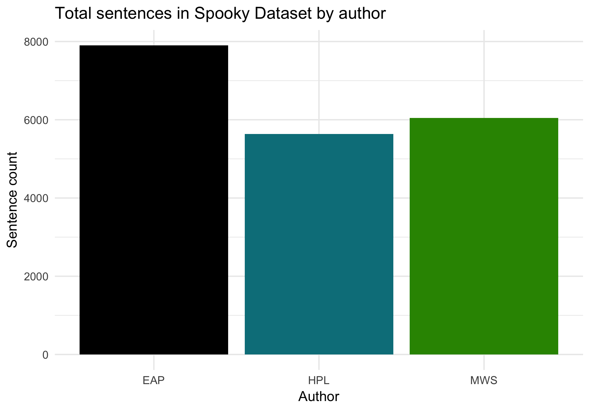

#### How long do everyone's sentences tend to be?
Lovecraft's are the most consistent, and Shelley's are the most extremely skewed.

##### Seen as histograms
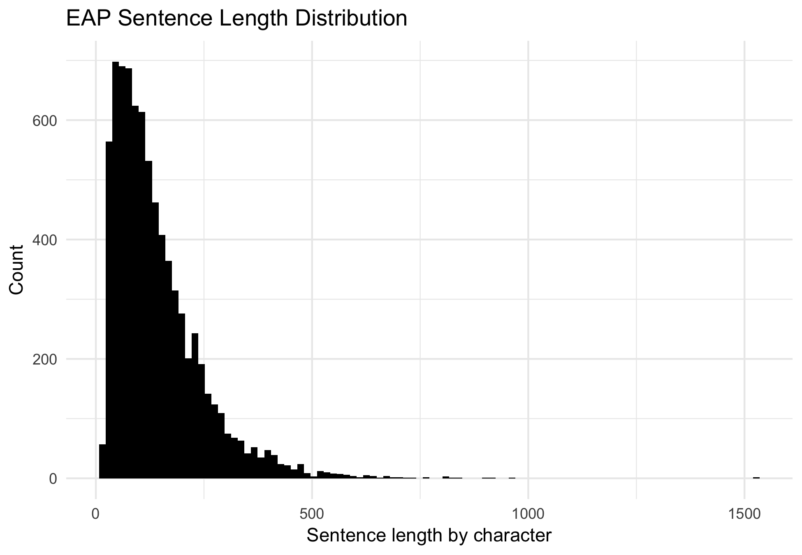
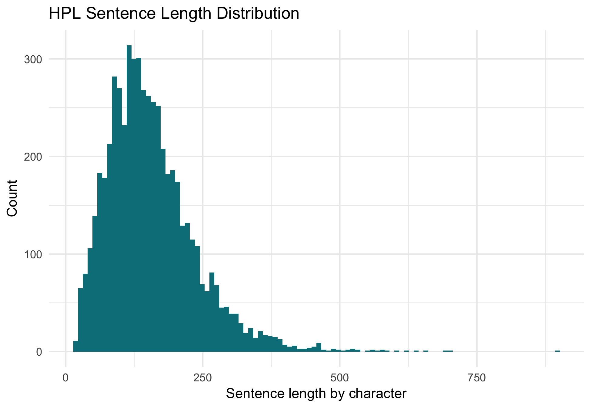

##### Seen as boxplots
Clearly, Poe tends to write the shortest sentences!
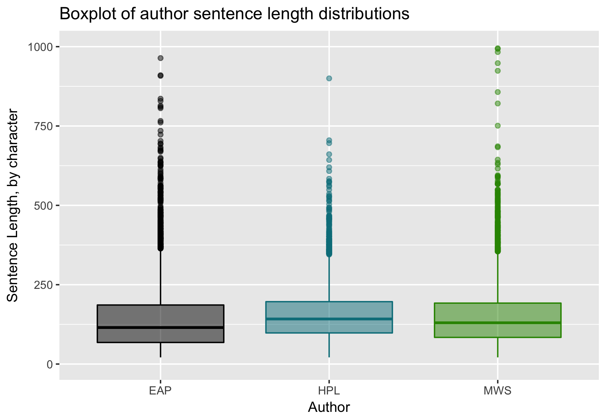

#### What are the longest and shortest sentences from each?
We can see that some of the longest sentences, especially in the case of Shelley, seem to be outliers: they're actually a bunch of shorter sentences lumped together by mistake.

##### EAP
###### Longest
> "Burning with the chivalry of this determination, the great Touch and go, in the next 'Tea Pot,' came out merely with this simple but resolute paragraph, in reference to this unhappy affair: 'The editor of the \"Tea Pot\" has the honor of advising the editor of the \"Gazette\" that he the \"Tea Pot\" will take an opportunity in tomorrow morning's paper, of convincing him the \"Gazette\" that he the \"Tea Pot\" both can and will be his own master, as regards style; he the \"Tea Pot\" intending to show him the \"Gazette\" the supreme, and indeed the withering contempt with which the criticism of him the \"Gazette\" inspires the independent bosom of him the \"TeaPot\" by composing for the especial gratification ? of him the \"Gazette\" a leading article, of some extent, in which the beautiful vowel the emblem of Eternity yet so offensive to the hyper exquisite delicacy of him the \"Gazette\" shall most certainly not be avoided by his the \"Gazette's\" most obedient, humble servant, the \"Tea Pot.\" \"So much for Buckingham\"' In fulfilment of the awful threat thus darkly intimated rather than decidedly enunciated, the great Bullet head, turning a deaf ear to all entreaties for 'copy,' and simply requesting his foreman to 'go to the d l,' when he the foreman assured him the 'Tea Pot' that it was high time to 'go to press': turning a deaf ear to everything, I say, the great Bullet head sat up until day break, consuming the midnight oil, and absorbed in the composition of the really unparalleled paragraph, which follows: 'So ho, John how now?"
###### Shortest
> "Many were quite awry."

##### HPL
###### Longest
> "A weak, filtered glow from the rain harassed street lamps outside, and a feeble phosphorescence from the detestable fungi within, shewed the dripping stone of the walls, from which all traces of whitewash had vanished; the dank, foetid, and mildew tainted hard earth floor with its obscene fungi; the rotting remains of what had been stools, chairs, and tables, and other more shapeless furniture; the heavy planks and massive beams of the ground floor overhead; the decrepit plank door leading to bins and chambers beneath other parts of the house; the crumbling stone staircase with ruined wooden hand rail; and the crude and cavernous fireplace of blackened brick where rusted iron fragments revealed the past presence of hooks, andirons, spit, crane, and a door to the Dutch oven these things, and our austere cot and camp chairs, and the heavy and intricate destructive machinery we had brought."
###### Shortest
> "But it was so silent."

##### MWS
###### Longest
> "Diotima approached the fountain seated herself on a mossy mound near it and her disciples placed themselves on the grass near her Without noticing me who sat close under her she continued her discourse addressing as it happened one or other of her listeners but before I attempt to repeat her words I will describe the chief of these whom she appeared to wish principally to impress One was a woman of about years of age in the full enjoyment of the most exquisite beauty her golden hair floated in ringlets on her shoulders her hazle eyes were shaded by heavy lids and her mouth the lips apart seemed to breathe sensibility But she appeared thoughtful unhappy her cheek was pale she seemed as if accustomed to suffer and as if the lessons she now heard were the only words of wisdom to which she had ever listened The youth beside her had a far different aspect his form was emaciated nearly to a shadow his features were handsome but thin worn his eyes glistened as if animating the visage of decay his forehead was expansive but there was a doubt perplexity in his looks that seemed to say that although he had sought wisdom he had got entangled in some mysterious mazes from which he in vain endeavoured to extricate himself As Diotima spoke his colour went came with quick changes the flexible muscles of his countenance shewed every impression that his mind received he seemed one who in life had studied hard but whose feeble frame sunk beneath the weight of the mere exertion of life the spark of intelligence burned with uncommon strength within him but that of life seemed ever on the eve of fading At present I shall not describe any other of this groupe but with deep attention try to recall in my memory some of the words of Diotima they were words of fire but their path is faintly marked on my recollection It requires a just hand, said she continuing her discourse, to weigh divide the good from evil On the earth they are inextricably entangled and if you would cast away what there appears an evil a multitude of beneficial causes or effects cling to it mock your labour When I was on earth and have walked in a solitary country during the silence of night have beheld the multitude of stars, the soft radiance of the moon reflected on the sea, which was studded by lovely islands When I have felt the soft breeze steal across my cheek as the words of love it has soothed cherished me then my mind seemed almost to quit the body that confined it to the earth with a quick mental sense to mingle with the scene that I hardly saw I felt Then I have exclaimed, oh world how beautiful thou art Oh brightest universe behold thy worshiper spirit of beauty of sympathy which pervades all things, now lifts my soul as with wings, how have you animated the light the breezes Deep inexplicable spirit give me words to express my adoration; my mind is hurried away but with language I cannot tell how I feel thy loveliness Silence or the song of the nightingale the momentary apparition of some bird that flies quietly past all seems animated with thee more than all the deep sky studded with worlds\" If the winds roared tore the sea and the dreadful lightnings seemed falling around me still love was mingled with the sacred terror I felt; the majesty of loveliness was deeply impressed on me So also I have felt when I have seen a lovely countenance or heard solemn music or the eloquence of divine wisdom flowing from the lips of one of its worshippers a lovely animal or even the graceful undulations of trees inanimate objects have excited in me the same deep feeling of love beauty; a feeling which while it made me alive eager to seek the cause animator of the scene, yet satisfied me by its very depth as if I had already found the solution to my enquires sic as if in feeling myself a part of the great whole I had found the truth secret of the universe But when retired in my cell I have studied contemplated the various motions and actions in the world the weight of evil has confounded me If I thought of the creation I saw an eternal chain of evil linked one to the other from the great whale who in the sea swallows destroys multitudes the smaller fish that live on him also torment him to madness to the cat whose pleasure it is to torment her prey I saw the whole creation filled with pain each creature seems to exist through the misery of another death havoc is the watchword of the animated world And Man also even in Athens the most civilized spot on the earth what a multitude of mean passions envy, malice a restless desire to depreciate all that was great and good did I see And in the dominions of the great being I saw man reduced?"
###### Shortest
> "Was my love blamable?"

### Text mining

#### Interesting words only

Let's look at the interesting words, and get rid of words like "and," "to," etc., that tell use very little about an author's vocabulary.

#### Word length

What are the longest words from each? 

It's interesting to see so much overlap! For example, "characteristically" shows up in both Poe and Shelley.

(The third column is how many letters are in a word.)

##### EAP
1	vondervotteimittiss	19	(Honestly, I'm not even sure)
	
2	incommunicativeness	19		

3	characteristically	18		

4	vondervotteimittis	18	(?)

5	goosetherumfoodle	17	(?)

6	conventionalities	17		

7	contradistinction	17		

8	sanctimoniousness	17		

9	consubstantialism	17		

10	transcendentalism	17	

##### HPL
1	congregationalists	18		

2	disproportionately	18		

3	misrepresentations	18		

4	indistinguishable	17		

5	inappropriateness	17	
	
6	unaussprechlichen	17	
	
7	inarticulateness	16	
	
8	incomprehensible	16	
	
9	indiscriminately	16	
	
10	enthusiastically	16	

##### MWS
1	characteristically	18		

2	disinterestedness	17		

3	selfconcentrated	16		

4	prognostications	16		

5	unextinguishable	16	
	
6	perpendicularity	16		

7	impracticability	16		

8	enthusiastically	16		

9	considerateness		15		

10	prognosticators		15	

#### How long do everyone's words tend to be?

When we make histograms, it's pretty hard to tell differences between the authors. Oh well!

##### EAP

##### HPL
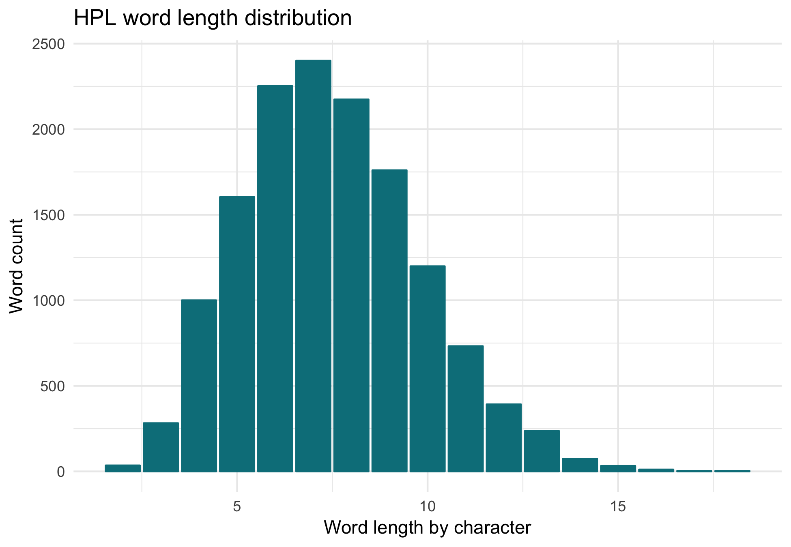

##### MWS

#### Diversity in vocabulary

How much do they tend to repeat or not repeat words - how "spread out" is their vocabulary?

Basically, the slope of a line from the origin to each datapoint tells us how many unique words the author uses. Clearly, HPL is *way* higher than the other two!

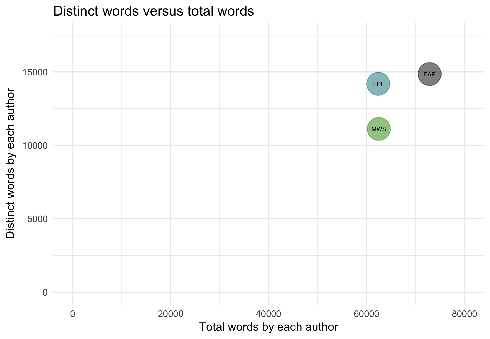

#### Word clouds

What words are used really often?

It looks like some of these are character names.
##### EAP
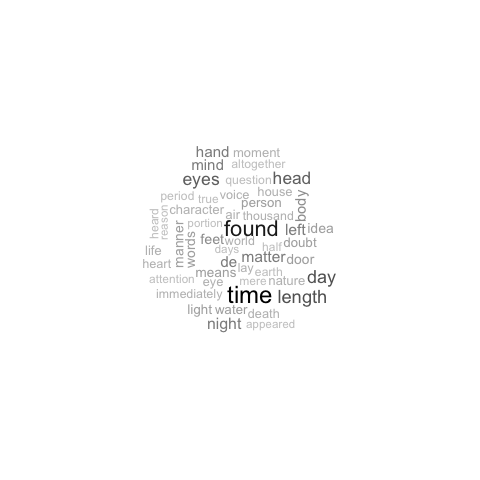

##### HPL

##### MWS
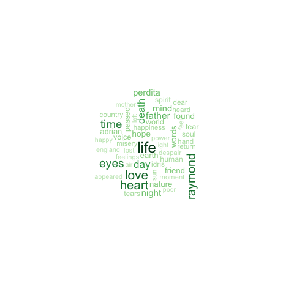

What are some words used less often?
##### EAP

##### HPL

##### MWS
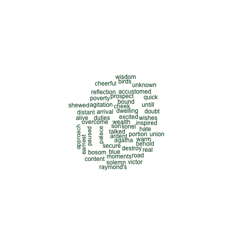

What are some words used almost never?

These are almost the most revealing of the set!
##### EAP
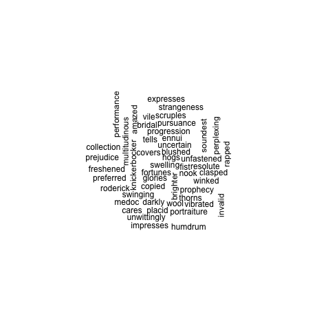

##### HPL

##### MWS
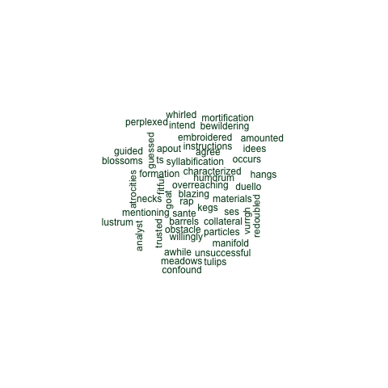

#### Gender imparity

How often do the authors use gender pronouns for women and men, overall? (a crude Bechdel test)

We can see about one fourth of *all* gender pronouns are female. Not so good.

And individually?

We can see that Shelley does the best, and Lovecraft very badly: not a single instance of the word "hers" shows up in his entire portion of the Spooky Dataset.

##### EAP

##### HPL
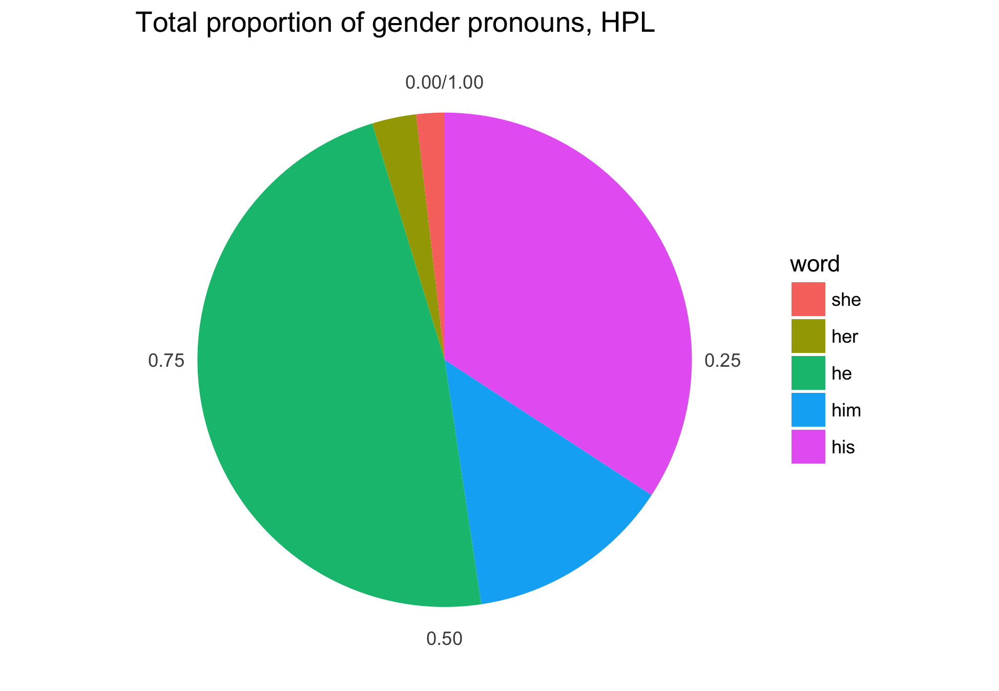

##### MWS
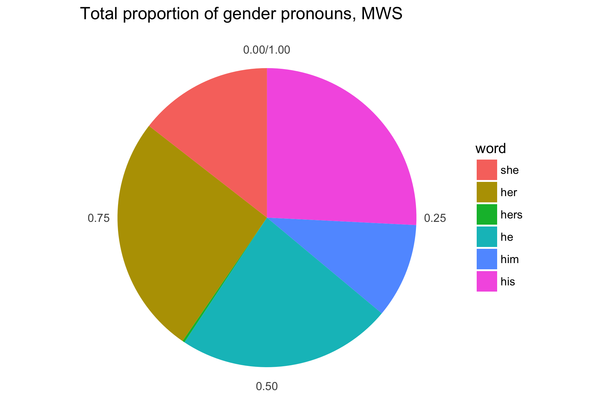

### Sentence annotation and named entities

What names of people and places show up? 

This is computationally intensive, so we only did a random sample of 100 sentences from each author.

So, it looks like maybe the place recognition engine doesn't do quite a good enough job of coming up with specific local places, but it does find a lot of large-scale places like countries.

##### EAP
   features             name
   
1    person          John A.

2    person          John A.

3    person Monsieur Simpson

4    person            Marie

5    person            Marie

6    person           Daddy"

7    person            Daddy

8    person           Robert

9    person           Marie"

10   person    Roman Emperor

11 location        Baltimore

12 location         Le Blanc

13 location          Mercury

14 location           France

15 location             Rome

##### HPL
   features          name
   
1    person Robert Jermyn

2    person        Gilman

3    person        Michel

4    person Arthur Jermyn

5    person        Angell

6    person    Joe Czanek

7    person  Manuel Silva

8  location            St

9  location  Water Street

10 location         Brook

11 location          West

##### MWS
   features          name
   
1    person         Felix

2    person         Felix

3    person        Claude

4    person        Lionel

5    person       Raymond

6    person       Perdita

7    person       Raymond

8    person       Raymond

9  location         Italy

10 location          Rome

11 location        London

12 location        London

13 location       England

14 location       Windsor

15 location        London

16 location         China

17 location Mediterranean

18 location       Windsor

19 location        Castle

### Combinations of words

We can tell a lot about an author's writing not just from what *words* show up, but from what *combinations* of words show up. In other words, what words often appear *together*?

#### Two words: bigrams

These were generated by removing boring words ("and", "to", etc., as mentioned above), so that we can look at them and only see the interesting ones!

These are very revealing.

##### EAP

##### HPL

##### MWS

#### Three or more words: n-grams

Now, we'll look at trigrams. We'll generate these *without* removing boring words. Here's some examples. The second two columns are frequency (how many times it shows up total) and proportion (what fraction of *all* trigrams that is).

##### EAP
1	one of the	36	5.416303e-04	

2	as well as	23	3.460416e-04	

3	that of the	19	2.858604e-04	

4	would have been	18	2.708152e-04	

5	of the most	17	2.557699e-04	

6	might have been	15	2.256793e-04	

7	I could not	14	2.106340e-04	

8	portion of the	14	2.106340e-04	

9	that is to	14	2.106340e-04	

10	which I had	14	2.106340e-04	

##### HPL
1	. . .	77	5.300694e-04	

2	out of the	48	3.304329e-04	

3	one of the	45	3.097808e-04	

4	I could not	41	2.822447e-04	

5	I did not	37	2.547087e-04	

6	that he was	31	2.134046e-04	

7	a kind of	28	1.927525e-04	

8	and in the	28	1.927525e-04	

9	seemed to be	26	1.789845e-04	

10	I saw that	26	1.789845e-04	

##### MWS
1	I did not	38	2.688153e-04	

2	I could not	35	2.475930e-04	

3	which I had	35	2.475930e-04	

4	I do not	28	1.980744e-04	

5	that I was	27	1.910003e-04	

6	that I had	27	1.910003e-04	

7	that I might	26	1.839263e-04	

8	that it was	24	1.697781e-04	

9	a part of	24	1.697781e-04	

10	that he was	23	1.627040e-04	

It's interesting to look at both how similar and different these are. Funny to see how Lovecraft is prone to using ellipses!

#### Babble!

We're going to make up a paragraph by using the trigrams we generated! Maybe this will more or less sound like the voice of each author (we hope!)!

##### EAP
> deep, great, odd, piquant, pertinent, and pretty. must have foreseen the chagrin of St. Eustache, Marie's betrothed, was found in the words of an ancient prophecy "A lofty name shall have  frenzy of mankind? to swim from Lofoden to Moskoe, was caught by the stream and borne down, while he roared terribly, so as to look about. not, alas departed, and would not be driven away, the white and ghastly crest, howling and shrieking forever.  between them, and commences a rapid descent into a vast amphitheatre entirely begirt with purple mountains, whose bases are laved by a gleaming river throughout the full extent of triumphant execution, in  and stronger reasons for believing them so deposited, than any which reaches their ears who indulge in the more remote gaieties of the other is hidden from  possible smiles, to be seated, while he made reference to the editorial opinions of the day. great general acuteness, and discriminative understanding, who make no scruple in pronouncing the Automaton a pure machine, unconnected with human agency  . 

##### HPL
> a veined, polished stone beyond his power to identify, and the tiles were cut in bizarre angled shapes which struck him as  and interment, began his task of transference one disagreeable April morning, but ceased before noon because of a heavy rain that seemed to emanate from unheard  or mental communication by means of suitable apparatus, and I had followed enthusiastically every aesthetic and intellectual movement which promised respite from our devastating ennui. be my realm,  under six feet tall, dressed in shabby blue civilian clothes and wearing a frayed grey golf cap. and made no pretence to literary style. haste just after the hour  over the rock tombs of Neb, nor any gaiety save the unnamed feasts of Nitokris beneath the Great Pyramid; yet in my new wildness and freedom I almost welcome the bitterness of alienage. the U to settle slowly down upon the rumbling hills. he larnt the secret he  . 

##### MWS
> I hired the chaise alone? the Protector of England. forth from this scene, and yet my enjoyment was embittered both by the memory of my mother whom he so passionately adored he might weaken the present impression. among  a spark of being into the lifeless thing that lay at my feet. this operation, and the nuts and roots much improved. have chosen with dreams and theories to overthrow my schemes for your own aggrandizement; but you shall not do the same by those I have formed for  love and kindness. winter our  must now be his companion through life; and if he did not credit it." the agitation with which I am acquainted; that cannot be; listen patiently until the end of all joy to me." were one of their great society, while I must keep the  seemed to be, a savage inhabitant of some undiscovered island, but a European. more plainly how well I had succeeded.  . 

### Emotions and style

#### Sentiments

##### Example words

Let's look at a few randomly chosen sentences and what words from each are positive and negative. The blank spaces mean there wasn't any word in that category (positive or negative) in that sentence.

###### EAP
            negative  positive
            
1:                        free

2:              alas          

3: confusion,despair   lighten

4:                   gentleman

5:         surrender       

###### HPL
   negative                                     positive
   
1: needless wonderful,ingenious,useful,useful,like,like,

2:      ill                                             

3:                                      properly,natural

4:                                                      

5:                                                      

###### MWS
                                negative               positive
                                
1:                                  slow   restored,wonderfully

2:        epidemic,force,pernicious,harm                       

3:                                       adorned,aid,art,favour

4: wretched,die,fear,famine,struck,wild,                        (yeah, that seems right!)

5:                                                                

##### Most extreme sentences
What are the most positive and negative sentences? From these examples, it's clear what a crude metric the sentiment calculation is: more of a heuristic than a really reflective score. Still, it's interesting to look at!

###### EAP
Positive:
> To die laughing, must be the most glorious of all glorious deaths Sir Thomas More a very fine man was Sir Thomas More Sir Thomas More died laughing, you remember.
Negative:
> Yet its memory was replete with horror horror more horrible from being vague, and terror more terrible from ambiguity.
###### HPL
Positive:
> I won't say that all this is wholly true in body, but 'tis sufficient true to furnish a very pretty spectacle now and then.
Negative:
> The odour of the fish was maddening; but I was too much concerned with graver things to mind so slight an evil, and set out boldly for an unknown goal.

###### MWS
Positive:
> Oh no I will become wise I will study my own heart and there discovering as I may the spring of the virtues I possess I will teach others how to look for them in their own souls I will find whence arrises this unquenshable love of beauty I possess that seems the ruling star of my life I will learn how I may direct it aright and by what loving I may become more like that beauty which I adore And when I have traced the steps of the godlike feeling which ennobles me makes me that which I esteem myself to be then I will teach others if I gain but one proselyte if I can teach but one other mind what is the beauty which they ought to love and what is the sympathy to which they ought to aspire what is the true end of their being which must be the true end of that of all men then shall I be satisfied think I have done enough Farewell doubts painful meditation of evil the great, ever inexplicable cause of all that we see I am content to be ignorant of all this happy that not resting my mind on any unstable theories I have come to the conclusion that of the great secret of the universe I can know nothing There is a veil before it my eyes are not piercing enough to see through it my arms not long enough to reach it to withdraw it I will study the end of my being oh thou universal love inspire me oh thou beauty which I see glowing around me lift me to a fit understanding of thee Such was the conclusion of my long wanderings I sought the end of my being I found it to be knowledge of itself Nor think this a confined study Not only did it lead me to search the mazes of the human soul but I found that there existed nought on earth which contained not a part of that universal beauty with which it was my aim object to become acquainted the motions of the stars of heaven the study of all that philosophers have unfolded of wondrous in nature became as it where sic the steps by which my soul rose to the full contemplation enjoyment of the beautiful Oh ye who have just escaped from the world ye know not what fountains of love will be opened in your hearts or what exquisite delight your minds will receive when the secrets of the world will be unfolded to you and ye shall become acquainted with the beauty of the universe Your souls now growing eager for the acquirement of knowledge will then rest in its possession disengaged from every particle of evil and knowing all things ye will as it were be mingled in the universe ye will become a part of that celestial beauty that you admire Diotima ceased and a profound silence ensued the youth with his cheeks flushed and his eyes burning with the fire communicated from hers still fixed them on her face which was lifted to heaven as in inspiration The lovely female bent hers to the ground after a deep sigh was the first to break the silence Oh divinest prophetess, said she how new to me how strange are your lessons If such be the end of our being how wayward a course did I pursue on earth Diotima you know not how torn affections misery incalculable misery withers up the soul.
Negative:
> He could have endured poverty, and while this distress had been the meed of his virtue, he gloried in it; but the ingratitude of the Turk and the loss of his beloved Safie were misfortunes more bitter and irreparable.

##### Overall distributions
What's each author's overall tendency toward positive or negative sentences?

When we compare, we see that, by a lot, Shelley has the greatest emotion range of the three.
###### EAP

###### HPL

###### MWS
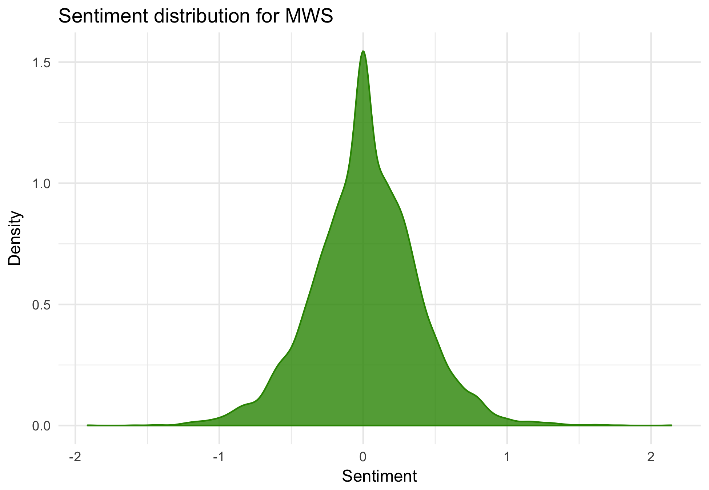

#### Formality

Who tends to be more formal? According to an analysis, samples from Poe tend to be the most formal, and Shelley the least. See "spooky.rmd" in the "/doc/" folder for more information!

#### Readability

Who tends to be the most readable, or least? The following calculations use the [classic Flesch-Kinciad measure](https://en.wikipedia.org/wiki/Flesch?Kincaid_readability_tests) to compute readability scores.

According to these plots, Poe's writing style is the most difficult, because a lower readability score means it's harder to read.

##### EAP
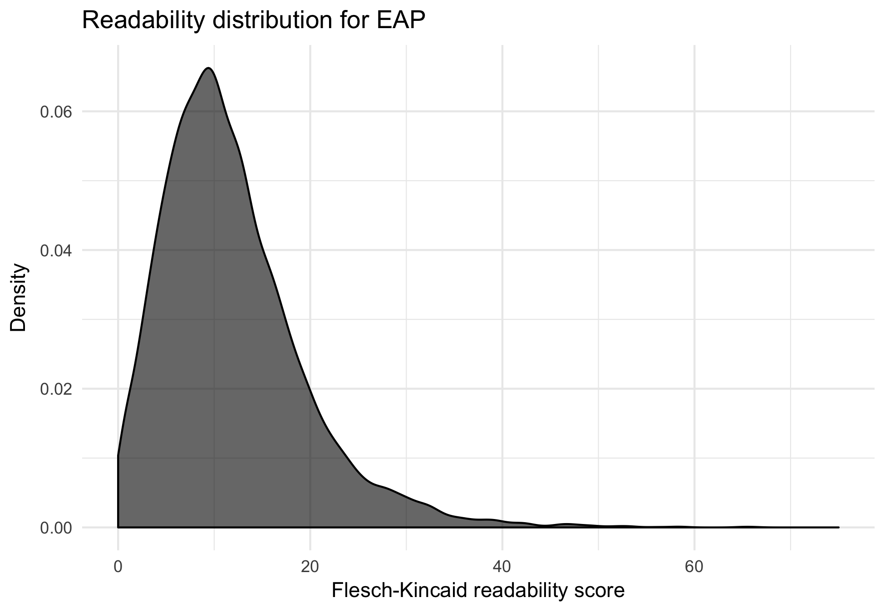

##### HPL

##### MWS

### Topics

What kinds of topics are our authors writing about?

#### Algorithm 1

We use a topic modeling algorithm called LDA, with a sampling algorithm called Gibbs.

##### Terms associated with generated topics
	
1.
> yet life ever heart even love

2.
> now friend raymond gave place father

3.
> seemed eyes thoguht still felt heart

4.
> first made thus every now without

5. 
> might much however indeed although even

6.
> will said never must little can

7.
> upon left room door head hand

8.
> far came like saw light beyond

9.
> one time night day many long

10.
> man old great things men house

##### Most representative sentences for each topic

(I'd like to add more commentary, but ran out of time before class.)

1.
> Oh no I will become wise I will study my own heart and there discovering as I may the spring of the virtues I possess I will teach others how to look for them in their own souls I will find whence arrises this unquenshable love of beauty I possess that seems the ruling star of my life I will learn how I may direct it aright and by what loving I may become more like that beauty which I adore And when I have traced the steps of the godlike feeling which ennobles me makes me that which I esteem myself to be then I will teach others if I gain but one proselyte if I can teach but one other mind what is the beauty which they ought to love and what is the sympathy to which they ought to aspire what is the true end of their being which must be the true end of that of all men then shall I be satisfied think I have done enough Farewell doubts painful meditation of evil the great, ever inexplicable cause of all that we see I am content to be ignorant of all this happy that not resting my mind on any unstable theories I have come to the conclusion that of the great secret of the universe I can know nothing There is a veil before it my eyes are not piercing enough to see through it my arms not long enough to reach it to withdraw it I will study the end of my being oh thou universal love inspire me oh thou beauty which I see glowing around me lift me to a fit understanding of thee Such was the conclusion of my long wanderings I sought the end of my being I found it to be knowledge of itself Nor think this a confined study Not only did it lead me to search the mazes of the human soul but I found that there existed nought on earth which contained not a part of that universal beauty with which it was my aim object to become acquainted the motions of the stars of heaven the study of all that philosophers have unfolded of wondrous in nature became as it where sic the steps by which my soul rose to the full contemplation enjoyment of the beautiful Oh ye who have just escaped from the world ye know not what fountains of love will be opened in your hearts or what exquisite delight your minds will receive when the secrets of the world will be unfolded to you and ye shall become acquainted with the beauty of the universe Your souls now growing eager for the acquirement of knowledge will then rest in its possession disengaged from every particle of evil and knowing all things ye will as it were be mingled in the universe ye will become a part of that celestial beauty that you admire Diotima ceased and a profound silence ensued the youth with his cheeks flushed and his eyes burning with the fire communicated from hers still fixed them on her face which was lifted to heaven as in inspiration The lovely female bent hers to the ground after a deep sigh was the first to break the silence Oh divinest prophetess, said she how new to me how strange are your lessons If such be the end of our being how wayward a course did I pursue on earth Diotima you know not how torn affections misery incalculable misery withers up the soul.

2.
> "Safie resolved to remain with her father until the moment of his departure, before which time the Turk renewed his promise that she should be united to his deliverer; and Felix remained with them in expectation of that event; and in the meantime he enjoyed the society of the Arabian, who exhibited towards him the simplest and tenderest affection.

3.
> I strained my sight to discover what it could be and uttered a wild cry of ecstasy when I distinguished a sledge and the distorted proportions of a well known form within. Oh With what a burning gush did hope revisit my heart Warm tears filled my eyes, which I hastily wiped away, that they might not intercept the view I had of the daemon; but still my sight was dimmed by the burning drops, until, giving way to the emotions that oppressed me, I wept aloud.

4.
> The paragraph beginning 'It is folly to suppose that the murder, etc.,' however it appears as printed in L'Etoile, may be imagined to have existed actually thus in the brain of its inditer 'It is folly to suppose that the murder, if murder was committed on the body, could have been committed soon enough to have enabled her murderers to throw the body into the river before midnight; it is folly, we say, to suppose all this, and to suppose at the same time, as we are resolved to suppose, that the body was not thrown in until after midnight' a sentence sufficiently inconsequential in itself, but not so utterly preposterous as the one printed.

5.
> The real observer would have uttered an instant ejaculation of surprise however prepared by previous knowledge at the singularity of their position; the fictitious observer has not even mentioned the subject, but speaks of seeing the entire bodies of such creatures, when it is demonstrable that he could have seen only the diameter of their heads It might as well be remarked, in conclusion, that the size, and particularly the powers of the man bats for example, their ability to fly in so rare an atmosphere if, indeed, the moon have any, with most of the other fancies in regard to animal and vegetable existence, are at variance, generally, with all analogical reasoning on these themes; and that analogy here will often amount to conclusive demonstration.

6.
> Burning with the chivalry of this determination, the great Touch and go, in the next 'Tea Pot,' came out merely with this simple but resolute paragraph, in reference to this unhappy affair: 'The editor of the "Tea Pot" has the honor of advising the editor of the "Gazette" that he the "Tea Pot" will take an opportunity in tomorrow morning's paper, of convincing him the "Gazette" that he the "Tea Pot" both can and will be his own master, as regards style; he the "Tea Pot" intending to show him the "Gazette" the supreme, and indeed the withering contempt with which the criticism of him the "Gazette" inspires the independent bosom of him the "TeaPot" by composing for the especial gratification ? of him the "Gazette" a leading article, of some extent, in which the beautiful vowel the emblem of Eternity yet so offensive to the hyper exquisite delicacy of him the "Gazette" shall most certainly not be avoided by his the "Gazette's" most obedient, humble servant, the "Tea Pot." "So much for Buckingham"' In fulfilment of the awful threat thus darkly intimated rather than decidedly enunciated, the great Bullet head, turning a deaf ear to all entreaties for 'copy,' and simply requesting his foreman to 'go to the d l,' when he the foreman assured him the 'Tea Pot' that it was high time to 'go to press': turning a deaf ear to everything, I say, the great Bullet head sat up until day break, consuming the midnight oil, and absorbed in the composition of the really unparalleled paragraph, which follows: 'So ho, John how now?

7.
> In the first place he opens the door No. I. Leaving this open, he goes round to the rear of the box, and opens a door precisely at the back of door No. I. To this back door he holds a lighted candle.

8.
> I invited him to walk with me, and led him to a neighbouring wood of beech trees whose light shade shielded us from the slant and dazzling beams of the descending sun After walking for some time in silence I seated my self with him on a mossy hillock It is strange but even now I seem to see the spot the slim and smooth trunks were many of them wound round by ivy whose shining leaves of the darkest green contrasted with the white bark and the light leaves of the young sprouts of beech that grew from their parent trunks the short grass was mingled with moss and was partly covered by the dead leaves of the last autumn that driven by the winds had here and there collected in little hillocks there were a few moss grown stumps about The leaves were gently moved by the breeze and through their green canopy you could see the bright blue sky As evening came on the distant trunks were reddened by the sun and the wind died entirely away while a few birds flew past us to their evening rest.

9.
> It was seen, that even at three per cent, the annual income of the inheritance amounted to no less than thirteen millions and five hundred thousand dollars; which was one million and one hundred and twenty five thousand per month; or thirty six thousand, nine hundred and eighty six per day, or one thousand five hundred and forty one per hour, or six and twenty dollars for every minute that flew.

10.
> Cxxl, nxw cxxl Dx be cxxl, yxu fxxl Nxne xf yxur crxwing, xld cxck Dxn't frxwn sx dxn't Dxn't hxllx, nxr hxwl, nxr grxwl, nxr bxw wxw wxw Gxxd Lxrd, Jxhn, hxw yxu dx lxxk Txld yxu sx, yxu knxw, but stxp rxlling yxur gxxse xf an xld pxll abxut sx, and gx and drxwn yxur sxrrxws in a bxwl' The uproar occasioned by this mystical and cabalistical article, is not to be conceived.

#### Algorithm 2

This time, we use CTM, and show the same results. Didn't have time for the algorithm to finish running by class, sorry!

##### Terms associated with generated topics
1.
> will said may can never shall

2.
> upon made well say however matter

3.
> eyes life death mind heart love

4.
> one two door room three body

5.
> night came saw light heard like

6.
> now upon must thus still let

7. 
> men though old street town trees

8.
> half left something old like began

9.
> things strange told old like ancient

10.
> man every time long day seemed

##### Most representative sentences for each topic
1.
> Ven I go marry my segonde usbande, Monsieur Lalande, at dat time I had de portraite take for my daughter by my first usbande, Monsieur Moissart" "Moissart" said I. "Yes, Moissart," said she, mimicking my pronunciation, which, to speak the truth, was none of the best, "and vat den?

2.
> He touched upon Latour and Markbrünnen; upon Mousseux and Chambertin; upon Richbourg and St. George; upon Haubrion, Leonville, and Medoc; upon Barac and Preignac; upon Grâve, upon Sauterne, upon Lafitte, and upon St. Peray.

3.
> All the genius that ennobled the blood of her father illustrated hers; a generous tide flowed in her veins; artifice, envy, or meanness, were at the antipodes of her nature; her countenance, when enlightened by amiable feeling, might have belonged to a queen of nations; her eyes were bright; her look fearless.

4.
> Before seating himself across the table from me, my host paused for a moment as if in embarrassment; then, tardily removing his gloves, wide brimmed hat, and cloak, stood theatrically revealed in full mid Georgian costume from queued hair and neck ruffles to knee breeches, silk hose, and the buckled shoes I had not previously noticed.

5.
> Endlessly down the horsemen floated, their chargers pawing the aether as if galloping over golden sands; and then the luminous vapours spread apart to reveal a greater brightness, the brightness of the city Celephaïs, and the sea coast beyond, and the snowy peak overlooking the sea, and the gaily painted galleys that sail out of the harbour toward distant regions where the sea meets the sky.

6.
> His full name long and pompous according to the custom of an age which had lost the trinomial simplicity of classic Roman nomenclature is stated by Von Schweinkopf to have been Caius Anicius Magnus Furius Camillus Æmilianus Cornelius Valerius Pompeius Julius Ibidus; though Littlewit rejects Æmilianus and adds Claudius Decius Junianus; whilst Bêtenoir differs radically, giving the full name as Magnus Furius Camillus Aurelius Antoninus Flavius Anicius Petronius Valentinianus Aegidus Ibidus.

7.
> In the brooding fire of autumn Carter took the old remembered way past graceful lines of rolling hill and stone walled meadow, distant vale and hanging woodland, curving road and nestling farmstead, and the crystal windings of the Miskatonic, crossed here and there by rustic bridges of wood or stone.

8.
> We have it upon good authority, that Mr. Fatquack received no less than sixty two cents and a half for his late Domestic Nouvelette, the 'Dish Clout.' "The contributors to the number before us are Mr. Crab, the eminent editor, Snob, Mumblethumb, Fatquack, and others; but, after the inimitable compositions of the editor himself, we prefer a diamond like effusion from the pen of a rising poet who writes over the signature 'Snob' a nom de guerre which we predict will one day extinguish the radiance of 'Boz.' 'Snob,' we learn, is a Mr. Thingum Bob, Esq., sole heir of a wealthy merchant of this city, Thomas Bob, Esq., and a near relative of the distinguished Mr. Thingum.

9.
> Cxxl, nxw cxxl Dx be cxxl, yxu fxxl Nxne xf yxur crxwing, xld cxck Dxn't frxwn sx dxn't Dxn't hxllx, nxr hxwl, nxr grxwl, nxr bxw wxw wxw Gxxd Lxrd, Jxhn, hxw yxu dx lxxk Txld yxu sx, yxu knxw, but stxp rxlling yxur gxxse xf an xld pxll abxut sx, and gx and drxwn yxur sxrrxws in a bxwl' The uproar occasioned by this mystical and cabalistical article, is not to be conceived.

10.
> My father was expected at noon but when I wished to return to meet him I found that I had lost my way: it seemed that in every attempt to find it I only became more involved in the intracacies of the woods, and the trees hid all trace by which I might be guided.

## Conclusion

Thank you for reading!

### Further directions I would pursue if I had more time

* I'm noticing there are some more interesting and sensitive analyses I can conceptualize that I might like to do -- but I'm running up against some limits in terms of time *and* in terms of trying to become more sophisticated at writing in `R`! 
  + Along these lines, I recognize that a lot of this code follows the pattern of 1) naming variables, 2) executing functions, and 3) drawing up plots, with identical code $\times$ three.
  + I'm not yet good enough at R to do the string formatting necessary to condense all of this into individual function calls that operate on all three authors.
  + I would welcome and *so* appreciate feedback on how I can improve this code to make it shorter, more readable, and more computationally efficient. A lot of this was groping in the dark to find syntax that did the job; I didn't think about optimization.
  
* Named entity recognition in French. As we discussed in tutorial, Poe tends to use a bunch of French words, including French names. Would our name and place recognizers turn up more thorough lists if we were also looking through French language models? Probably!

* Punctuation as proxy for sentence complexity. The annotation we produced can be used to collect information about number of particular punctuation marks, which we could use a proxy for how many clauses a sentence has or, more generally, how complex an author's sentences tend to be.
  + I was having tremendous trouble using the `Annotation` objects to recover the text information they refer to. Maybe there is part of the `openNLP` documentation that I missed that explains, for example, an easy way to get the `word` a particular `Annotation` refers to, but I had to use some vulgar string indexing to find them.
  + Also, I was not sure how to access the information in the `features` column of each `Annotation` object easily. Maybe this is because I need to become better at subsetting in `R`.

* Types of sentences (such as question, imperative, etc.). I imagine it's likely there is an NLP functionality available within one of the packages I've used to predict sentence type, and this could be very revealing about author's styles. For example, do they tend to write dialog in different proportion? I didn't luck out on finding this functionality.

* Clustering sentences according to what *emotions* often occur together. The `sentimentr` package didn't compute values for a range of emotions, only for positive and negative.

* Explore the Stanford NLP software. I wasn't able to figure out how to interface with it, but it seems to include very powerful and comprehensive functionalities for most of the analyses performed in this report.

* Run topic modeling on individual author corpora. Maybe this would reveal more distinctive topics, more individually linked. Because I wanted this report to be reproduce and run in a short amount of time, and because running the topic modeling algorithms takes so long, I didn't include topic models for individual authors.

* Do some illustrative visualization of the topic models generated. For example, what can we visualize about the popularity of each topic? About the probability each word is associated with the generated topics?

