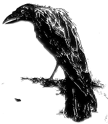

```{r setup, include=FALSE}
knitr::opts_chunk$set(echo = TRUE)
```

# Introduction

What's the scope of this *terrifying* project?

We're going to try to figure out as much as we can about the writing styles of three authors using natural language processing methods.

The three authors are Mary Wollstonecraft Shelley, H. P. Lovecraft, and Edgar Allen Poe.

This data originally comes from a Kaggle dataset we'll call the Spooky Dataset. This was part of a [competition](https://www.kaggle.com/c/spooky-author-identification) that happened in late 2017. That project involved building an author predictor, which we don't do here.

## Basic issues

* Are we doing analysis at the word, phrase, sentence, or corpus level?

* I'm noticing there are some more interesting and sensitive analyses I can conceptualize that I might like to do -- but I'm running up against some limits in terms of time *and* in terms of trying to become more sophisticated at writing in `R`! 
  + Along these lines, I recognize that a lot of this code follows the pattern of 1) naming variables, 2) executing functions, and 3) drawing up plots, with identical code $\times$ three.
  + I'm not yet good enough at R to do the string formatting necessary to condense all of this into individual function calls that operate on all three authors.

# First steps

## Packages

This analysis depends on using a number of R packages.

```{r Install necessary packages, message=FALSE}
# First, we check if dplyr is installed, and install it if necessary, so that
# its convenient pipeline notation is immediately available. Then we load dplyr.
if (!("dplyr" %in% installed.packages())){
  install.packages("dplyr")
}
library(dplyr)

# Now, we rewrite code equivalent to that provided in the in-class tutorial, 
# using the pipeline operator instead for more intuitive presentation. 

# Alphabetic list of all packages used in this analysis.
packages.used <- c("ggplot2",
                   "graphics",
                   "ngram",
                   "NLP",
                   "openNLP", 
                   "qdap",
                   "quanteda",
                   "RColorBrewer",
                   "rJava", # Needed for openNLP
                   "rmarkdown", # Needed for pretty floating table of contents
                   "sentimentr",
                   "stringr", 
                   "tibble",
                   "tidyr",
                   "tidytext",
                   "tm",
                   "topicmodels",
                   "wordcloud")

# Determine what packages are not yet installed, and install them.
packages.needed <- 
  # What packages does this project use?
  packages.used %>%
  # What packages are *both* being used *and* already installed?
  intersect(installed.packages()[,1]) %>%
  # What packages are used, but *not* installed?
  setdiff(packages.used, .)

if(length(packages.needed) > 0) {
  install.packages(packages.needed,
                   dependencies = TRUE, 
                   repos = 'http://cran.us.r-project.org',
                   quiet = TRUE)}

# The openNLPmodels.en package is not available from the CRAN repository. 
# So we'll include a separate condition to check if we have it, and install it if necessary.
if (!("openNLPmodels.en" %in% installed.packages())){
 install.packages("openNLPmodels.en",
                  repos = 'http://datacube.wu.ac.at/',
                  type = 'source',
                  quiet = TRUE)}
```

```{r Load all libraries, message=FALSE}
# Now, we load all the packages used.
library(ggplot2)
library(graphics)
library(ngram)
library(NLP)
library(openNLP)
library(openNLPmodels.en)
library(qdap)
library(quanteda)
library(RColorBrewer)
library(rJava)
library(rmarkdown)
library(sentimentr)
library(stringr)
library(tibble)
library(tidyr)
library(tidytext)
library(topicmodels)
library(tm)
library(wordcloud)
```

## First look at the data

This section reproduces and slightly extends what was covered during tutorial.

```{r Read in}
# First, we read in the data.
spooky <- read.csv('../data/spooky.csv', as.is = TRUE)
```

Now, we run some familiar summarizing functions in base R to get a sense of what we're dealing with.

```{r Basic characeristics, echo=TRUE}
# What format are the data in?
class(spooky)

# What are the dimensions of the data?
# As we can see, the Spooky Dataset contains 19,579 sentences.
dim(spooky)

# How are the data labeled, and what types are they?
# As we can see, each row has a unique sentence ID, the text of the single sentence 
# that corresponds, and the initials of the author: {"EAP", "MWS", "HPL"}.
# summary(spooky)
# This command wasn't working and wasn't essentially so it's temporarily commented out.

# Let's look at a couple entries.
head(spooky)

# Are there any missing entries? As discussed in class, no!
sum(is.na(spooky))
```

# Data exploration

Let's do some basic exploration of the data.

## Colors

First things first! In this report, we'll be visualizing a lot of comparisons between our three authors. So let's associate each author with a characteristic color from now on: 

* pure *black* for Poe (EAP), because we're all thinking about the raven,



* a frightening deep *aquamarine*---symbolizing Cthulhu---for Lovecraft (HPL),


* and a sickly *green*---recalling Dr. Frankenstein's monster---for Shelley (MWS).


```{r Define author colors}
# I picked these from an online hexidecimal color selection tool.
EAP_color = "#000000"
HPL_color = "#007E8A"
MWS_color = "#2F9201"
author_colors = c(EAP_color, HPL_color, MWS_color)
```

## Sentences by author

Let's find out how many sentences each author contributes to the Spooky Dataset.

```{r Tally author sentences}
spooky$author <- as.factor(spooky$author)

EAP_sentence_num <-
  spooky %>%
  tally(author=="EAP") %>%
  as.integer()
HPL_sentence_num <-
  spooky %>%
  tally(author=="HPL") %>%
  as.integer()
MWS_sentence_num <-
  spooky %>%
  tally(author=="MWS") %>%
  as.integer()
print("Sentences from Poe:")
EAP_sentence_num
print("Sentences from Lovecraft:")
HPL_sentence_num
print("Sentences from Shelley:")
MWS_sentence_num
```

Let's look at this visually. 

```{r Visualize author sentence number plot, message=TRUE}
g_total_sentences <- ggplot(spooky, aes(x = spooky$author)) +
  geom_bar(fill = author_colors) +
  xlab("Author") +
  ylab("Sentence count") +
  ggtitle("Total sentences in Spooky Dataset by author") +
  theme(legend.position = "none") +
  theme_minimal()
g_total_sentences
```

```{r Visualizate author sentence totals, message=FALSE}
ggsave("../figs/g_total_sentences.png", g_total_sentences, device = "png")
```

So, for example, we have almost 8,000 sentences from Poe, and less than 6000 from Lovecraft. 

There are several implications of these differences in sample sizes and how they make up our dataset.

One implication we don't pursue in this analysis is about predictive modeling. Because Poe is represented in greater portion in the Spooky Dataset, a model trained on it might be more likely to predict the author of a new test sentence is Poe.

Another implication is more relevant for this analysis: we have to be be careful about comparing absolute quantities between authors. Instead, when appropriate, we should normalize the attribute in question by each author's respective proportion.

## Sentence length distribution

What can we say about each author's style in terms of sentence length?

We can assume that the number of characters in each Spooky Dataset entry are a fairly accurate proxy for sentence length. Here, we replicate and extend the character-length analysis done in class.

```{r Calculate sentence length}
# Calculate the number of characters in each sentence.
# Add a new column to spooky containing this information.
spooky_with_lengths <-
  spooky %>%
  mutate(charLength=nchar(.$text))
```

```{r Dataframes by author}
# We set up different dataframes for each author to facilitate separate charts.
# This will facilitate getting further into individual details later.
# We'll remove both the sentence identifiers as well as the author names,
# because we're not using the former, and the latter is implied
# by the new dataframes' names.

# Note that running summary() on any of these dataframes takes so long that,
# in effect, it causes R to crash. So we'll make sure we don't do that!

EAP <-
  spooky_with_lengths %>%
  filter(author=="EAP") %>%
  select(text:charLength)
HPL <-
  spooky_with_lengths %>%
  filter(author=="HPL") %>%
  select(text:charLength)
MWS <-
  spooky_with_lengths %>%
  filter(author=="MWS") %>%
  select(text:charLength)
```

Let's see:

```{r Generate sentence length distribution plots, message=FALSE}
g_EAP_sent_char_dist <- ggplot(EAP, aes(x = charLength)) +
  geom_histogram(bins = 100, fill = EAP_color) +
  xlab("Sentence length by character") +
  ylab("Count") +
  ggtitle("EAP Sentence Length Distribution") +
  theme(legend.position = "none") +
  theme_minimal()
ggsave("../figs/g_EAP_sent_char_dist.png", g_EAP_sent_char_dist, device = "png")

g_HPL_sent_char_dist <- ggplot(HPL, aes(charLength)) +
  geom_histogram(bins = 100, fill = HPL_color) +
  xlab("Sentence length by character") +
  ylab("Count") +
  ggtitle("HPL Sentence Length Distribution") +
  theme(legend.position = "none") +
  theme_minimal()
ggsave("../figs/g_HPL_sent_char_dist.png", g_HPL_sent_char_dist, device = "png")

g_MWS_sent_char_dist <- ggplot(MWS, aes(charLength)) +
  geom_histogram(bins = 100, fill = MWS_color) +
  xlab("Sentence length by character") +
  ylab("Count") +
  ggtitle("MWS Sentence Length Distribution") +
  theme(legend.position = "none") +
  theme_minimal()
ggsave("../figs/g_MWS_sent_char_dist.png", g_MWS_sent_char_dist, device = "png")
```

```{r Visualize sentence length distribution}
g_EAP_sent_char_dist
g_HPL_sent_char_dist
g_MWS_sent_char_dist
```

This is interesting! Each author's sentence length distribution is skewed, but it looks like Shelley has the most extreme values. 

Let's order each of these individual sets by length, and then look at the longest and shortest ones:

```{r Range-defining sentences}
EAP <- arrange(EAP, desc(charLength))
HPL <- arrange(HPL, desc(charLength))
MWS <- arrange(MWS, desc(charLength))

# (The following console displays are not PDF-friendly.)
# Poe's longest and shortest sentences:
head(EAP$text, n=1)
tail(EAP$text, n=1)

# Lovecraft's:
head(HPL$text, n=1)
tail(HPL$text, n=1)

# Shelley's:
head(MWS$text, n=1)
tail(MWS$text, n=1)
```

One takeaway from this analysis is that maximum-length sentences from both Poe and Shelley are *outliers*. 

In the case of Poe, it appears this "sentence" includes an excerpt from a piece of writing printed in a magazine or paper, lacking sentence delimiters. In other words, this longest sentence, and perhaps several of the other longest ones, don't tell us much about his writing style.

In the case of Shelley, it seems that the "sentence" in question is actually many sentences, and that the original dataset is corrupt either due to data entry errors or bugs in the original sentence delimitation implementation. The same conclusion applies: these outliers are not informative.

Finally, let's look at the summary data for this sentence-length metric.

```{r Sentence length summary calculation}
summary(EAP$charLength)
summary(HPL$charLength)
summary(MWS$charLength)
```

Clearly, Poe tends to write shorter sentences: both the mean and median character length of his sentences are less than that of the other two authors.

Finally, let's use boxplots to visualize these distributions. 

After generating boxplots with no upper limit for sentence length, on the y-axis, it was clear the graphic is uninformative without excluding outliers. So I set the y-axis upper limit at 1,000 characters, so the visualization reveals more about the observations we are interested in.

```{r Generate boxplot for sentence length, message=FALSE, warning=FALSE}
g_sent_char_box <- ggplot(spooky_with_lengths, aes(x = author, y = charLength)) +
  geom_boxplot(fill = author_colors,
               color = author_colors,
               alpha = 0.5) +
  scale_x_discrete(name = "Author") +
  scale_y_continuous(name = "Sentence Length, by character",
                     limits = c(0,1000)) +
  ggtitle("Boxplot of author sentence length distributions")
ggsave("../figs/g_sent_char_box.png", g_sent_char_box, device = "png")
```

```{r Show boxplot}
g_sent_char_box
```

One interesting takeaway is revealed by using partial transparency to show the data points. As we saw in the histograms that showed us skewed distribution, we can see here that there are a large number of sentences for each author that are far longer than the limits of the interquartile range.

# Text Mining

Here, we move into using package functionality to reveal more information within the data.

## Words, words, and more words

Again, we'll reproduce and extend the in-class analysis.

```{r List of all the words, message=FALSE}
# As in tutorial, we create a tidy tibble by unnesting the entire Spooky Dataset
# into a dataframe where each row has just one word.
spooky_words <- 
  spooky %>%
  unnest_tokens(word, text)

# We create a new dataframe without any of the tidytext stop words.
# In effect, we remove all the common English words that don't tell us
# anything about the authors' writing style.
spooky_words_no_stop <-
  spooky_words %>%
  anti_join(stop_words)
```

```{r Interesting words by author}
# Extract the total set of non-stop words from each author.
EAP_words <-
  spooky_words_no_stop %>%
  filter(author == "EAP") %>%
  select(word)

HPL_words <-
  spooky_words_no_stop %>%
  filter(author == "HPL") %>%
  select(word)

MWS_words <-
  spooky_words_no_stop %>%
  filter(author == "MWS") %>%
  select(word)
```

### Word length distributions

Now that we have lists of interesting words from each author, what we can measure about the sizes of words each author uses?

```{r Word length determination}
EAP_words_unique <-
  EAP_words %>%
  # Let's reduce each author's corpus to unique words.
  unique() %>%
  # Also, we'll count the number of characters for each word,
  mutate(word_length = nchar(word)) %>%
  # and then rank them in order of descending length.
  arrange(desc(word_length))

HPL_words_unique <-
  HPL_words %>%
  unique() %>%
  mutate(word_length = nchar(word)) %>%
  arrange(desc(word_length))

MWS_words_unique <-
  MWS_words %>%
  unique() %>%
  mutate(word_length = nchar(word)) %>%
  arrange(desc(word_length))
```

What are the longest words each author uses?

```{r Maximum-length words}
head(EAP_words_unique, 20)
head(HPL_words_unique, 20)
head(MWS_words_unique, 20)
```

How fun!

How about the distribution of characters per word, for each author?

```{r Generate word-length distribution visualizations, message=FALSE}

g_EAP_word_length <- ggplot(EAP_words_unique, aes(word_length)) +
  geom_bar(color=EAP_color, fill=EAP_color) +
  theme_minimal() +
  ggtitle("EAP word length distribution") +
  xlab("Word length by character") +
  ylab("Word count")
ggsave("../figs/g_EAP_word_length.png", g_EAP_word_length, device = "png")

g_HPL_word_length <- ggplot(HPL_words_unique, aes(word_length)) +
  geom_bar(color=HPL_color, fill=HPL_color) +
  theme_minimal() +
  ggtitle("HPL word length distribution") +
  xlab("Word length by character") +
  ylab("Word count")
ggsave("../figs/g_HPL_word_length.png", g_HPL_word_length, device = "png")

g_MWS_word_length <- ggplot(MWS_words_unique, aes(word_length)) +
  geom_bar(color=MWS_color, fill=MWS_color) +
  theme_minimal() +
  ggtitle("MWS word length distribution") +
  xlab("Word length by character") +
  ylab("Word count")
ggsave("../figs/g_MWS_word_length.png", g_MWS_word_length, device = "png")
```

```{r Visualize word-length distributions}
g_EAP_word_length
g_HPL_word_length
g_MWS_word_length
```

Clearly, these distributions all have a mean of about 7 characters. It seems word length is not a very revealing metric!

### Vocabulary

Maybe we're interested in finding something out about the vocabulary each of the authors uses.

```{r Tally author vocabulary counts}
# The table() function counts the occurence of each row of %author_words.
# Then, so we can see the most and least frequent words in each author's vocabulary,
# we turn the table into a dataframe and arrange it by descending frequency,
# so that the most common words are at the top.

EAP_words_ranked <-
  EAP_words %>%
  table() %>%
  as.data.frame() %>%
  arrange(desc(Freq))

HPL_words_ranked <-
  HPL_words %>%
  table() %>%
  as.data.frame() %>%
  arrange(desc(Freq))

MWS_words_ranked <-
  MWS_words %>%
  table() %>%
  as.data.frame() %>%
  arrange(desc(Freq)) 
```

Let's think about a simple metric for the "spread" of each author's vocabulary.

```{r Vocabulary sizes}
# How many total words, with repetition, are used by each author?
EAP_words_total <- dim(EAP_words)[1]
HPL_words_total <- dim(HPL_words)[1]
MWS_words_total <- dim(MWS_words)[1]

# How many unique words (without repetition, that is), are used by each author?
EAP_voc_size <- dim(EAP_words_ranked)[1]
HPL_voc_size <- dim(HPL_words_ranked)[1]
MWS_voc_size <- dim(MWS_words_ranked)[1]
```

Let's see what these look like in comparison.

```{r Set up dataframe}
words_total <- c(EAP_words_total, HPL_words_total, MWS_words_total)
voc_size <- c(EAP_voc_size, HPL_voc_size, MWS_voc_size)
voc_data <- data.frame(words_total, voc_size, row.names = c("EAP", "HPL", "MWS"))
```

```{r Generate vocabulary distributions and word repetition visualizations, message=FALSE}
g_voc_proportions <- ggplot(voc_data, aes(x = words_total, y = voc_size)) +
  geom_point(color = author_colors, size=10, alpha=0.5) +
  xlab("Total words by each author") +
  ylab("Distinct words by each author") +
  xlim(0, 80000) +
  ylim(0, 17500) +
  ggtitle("Distinct words versus total words") +
  geom_text(size = 2,
            label = row.names(voc_data)) +
  theme_minimal()
ggsave("../figs/g_voc_proportions.png", g_voc_proportions, device = "png")
```

```{r Visualize vocabulary distributions}
g_voc_proportions
```

In fact, this visualizing is quite revealing. 

Suppose our metric for the spread of an author's vocabulary is $\frac{\text{unique words}}{\text{total words}}$. Note this metric is the same as the slope of a line through the origin to any given datapoint in the above plot.

In other words, if all three authors had the same tendencies for how frequently they repeat words within a given sample, we would expect all three datapoints to fall upon the same line, and they clearly don't!

```{r Vocabulary spread}
voc_data <-
  voc_data %>%
  mutate(spread = voc_size/words_total)
# (dplyr functions like mutate, etc. discard row names, so we add them again.)
rownames(voc_data) <- c("EAP", "HPL", "MWS")
voc_data
```

This metric shows that Lovecraft, compared to either of the other two authors, has a significantly larger tendency to use more unique words within a given sample.

This metric helpfully lends a `quantitative` confirmation to our intuition that Lovecraft makes up a lot of words, like in demon speech ("ph'nglui mglw'nafh Cthulhu R'lyeh wgah'nagl fhtagn"), etc.!

### Wordclouds

How come word clouds are helpful? They help give us a qualitative sense of what collections of words from an author's writing *feel* like.

During the in-class tutorial, we generated wordclouds of each author's most common words. Let's reproduce and extend that here!

```{r Colors play}
# To create an attractive visualization, we generate sequential color palettes
# based on each author's characteristic color.
EAP_seq_colors <- colorRampPalette(brewer.pal(9, "Greys"))(20)
HPL_seq_colors <- colorRampPalette(brewer.pal(9, "Blues"))(20)
MWS_seq_colors <- colorRampPalette(brewer.pal(9, "Greens"))(20)
```

```{r Wordclouds of most common words}
# We can easily change the number of words included in each cloud; just change num_words.
num_words <- 50

# Because we'd like to look at a lot of words to get a better sense of
# what these authors are saying, we'll use a smaller font size
# than the default setting.
small_scale <- c(2, 0.5)

# Using sequential palettes lets us visualize common word frequency in terms of color darkness.
wordcloud(EAP_words_ranked$.,
          EAP_words_ranked$Freq,
          scale = small_scale,
          max.words = num_words,
          colors = EAP_seq_colors)
wordcloud(HPL_words_ranked$.,
          HPL_words_ranked$Freq,
          scale = small_scale,
          max.words = num_words,
          colors = HPL_seq_colors)
wordcloud(MWS_words_ranked$.,
          MWS_words_ranked$Freq,
          scale = small_scale,
          max.words = num_words,
          colors = MWS_seq_colors)
```

```{r Create wordcloud PDFs & PNGs, message=FALSE}
pdf("../figs/EAP_common_wordcloud.pdf")
wordcloud(EAP_words_ranked$.,
          EAP_words_ranked$Freq,
          scale = small_scale,
          max.words = num_words,
          colors = EAP_seq_colors)
dev.off()

png("../figs/EAP_common_wordcloud.png")
wordcloud(EAP_words_ranked$.,
          EAP_words_ranked$Freq,
          scale = small_scale,
          max.words = num_words,
          colors = EAP_seq_colors)
dev.off()


pdf("../figs/HPL_common_wordcloud.pdf")
wordcloud(HPL_words_ranked$.,
          HPL_words_ranked$Freq,
          scale = small_scale,
          max.words = num_words,
          colors = HPL_seq_colors)
dev.off()

png("../figs/HPL_common_wordcloud.png")
wordcloud(HPL_words_ranked$.,
          HPL_words_ranked$Freq,
          scale = small_scale,
          max.words = num_words,
          colors = HPL_seq_colors)
dev.off()

pdf("../figs/MWS_common_wordcloud.pdf")
wordcloud(MWS_words_ranked$.,
          MWS_words_ranked$Freq,
          scale = small_scale,
          max.words = num_words,
          colors = MWS_seq_colors)
dev.off()

png("../figs/MWS_common_wordcloud.png")
wordcloud(MWS_words_ranked$.,
          MWS_words_ranked$Freq,
          scale = small_scale,
          max.words = num_words,
          colors = MWS_seq_colors)
dev.off()
```

What if we go further down the list?

```{r Wordclouds of less common words}
# How many words do we want to visualize?
num_words <- 50

# Where on the list should we start?
# The higher that start_index is, the more uncommon words we're looking at!
start_index <- 500

# Take the span! We produce a subset of the full ranked words list
# beginning at start_index and with length num_words.
mid_EAP <- EAP_words_ranked[start_index:(start_index + num_words),]
mid_HPL <- HPL_words_ranked[start_index:(start_index + num_words),]
mid_MWS <- MWS_words_ranked[start_index:(start_index + num_words),]

# Note that the color palette and text sizing aren't important now,
# because as we descend the frequency list, more words will have the same frequency
# as the words are used less and less.
# So we'll just let all the words be represented with the same font size.
constant_scale <- c(1, 1)

wordcloud(mid_EAP$., mid_EAP$Freq, scale = constant_scale,
          max.words = num_words, colors = EAP_seq_colors)
wordcloud(mid_HPL$., mid_HPL$Freq, scale = constant_scale,
          max.words = num_words, colors = HPL_seq_colors)
wordcloud(mid_MWS$., mid_MWS$Freq, scale = constant_scale,
          max.words = num_words, colors = MWS_seq_colors)
```

```{r Create more wordcloud PDFs, message=FALSE}
pdf("../figs/EAP_mid_wordcloud.pdf")
wordcloud(mid_EAP$., mid_EAP$Freq, scale = constant_scale, max.words = num_words, colors = EAP_seq_colors)
dev.off()

png("../figs/EAP_mid_wordcloud.png")
wordcloud(mid_EAP$., mid_EAP$Freq, scale = constant_scale, max.words = num_words, colors = EAP_seq_colors)
dev.off()

pdf("../figs/HPL_mid_wordcloud.pdf")
wordcloud(mid_HPL$., mid_HPL$Freq, scale = constant_scale, max.words = num_words, colors = HPL_seq_colors)
dev.off()

png("../figs/HPL_mid_wordcloud.png")
wordcloud(mid_HPL$., mid_HPL$Freq, scale = constant_scale, max.words = num_words, colors = HPL_seq_colors)
dev.off()

pdf("../figs/MWS_mid_wordcloud.pdf")
wordcloud(mid_MWS$., mid_MWS$Freq, scale = constant_scale, max.words = num_words, colors = MWS_seq_colors)
dev.off()

png("../figs/MWS_mid_wordcloud.png")
wordcloud(mid_MWS$., mid_MWS$Freq, scale = constant_scale, max.words = num_words, colors = MWS_seq_colors)
dev.off()
```

Now, suppose we want to look at some strange words the authors don't use very often. Perhaps this will give us a sense of the texture of the writing that complements what we can find out from the most-used words!

We run into a problem when we try to generate wordclouds by simply taking a span from near the *bottom* of each list! Because these words are so uncommon, and because, consequently, there are so many of them, if you choose any one span, they're all likely to start with the same letter, which doesn't tell us that much!

Therefore, we'll subset the ranked word lists by choosing words of some frequency -- and the choose a random sample from that selection. This should give us words beginning with different letters, and thus a better qualitative sense of what these more uncommon words are like.

```{r Generate some uncommon words}
# Choose what frequency of words we wish to examine.
freq <- 3

# Choose how many words to visualize.
num_words <- 50

# Filter the ranked words list to find words of that frequency.
# Randomly sample those lists to pick which words to visualize.
# We use the dplyr sample_n function to take a s

low_EAP <-
  EAP_words_ranked %>%
  filter(., Freq == freq) %>%
  sample_n(num_words)
low_HPL <-
  EAP_words_ranked %>%
  filter(., Freq == freq) %>%
  sample_n(num_words)
low_MWS <-
  EAP_words_ranked %>%
  filter(., Freq == freq) %>%
  sample_n(num_words)
```

And voila:

```{r Wordclouds of really uncommon words}
# Note that these wordclouds should be different every time the preceding
# code chunk is run, because it creates a random selection.
wordcloud(low_EAP$., low_EAP$Freq, scale = constant_scale,
          max.words = num_words, colors = EAP_seq_colors)
wordcloud(low_HPL$., low_HPL$Freq, scale = constant_scale,
          max.words = num_words, colors = HPL_seq_colors)
wordcloud(low_MWS$., low_MWS$Freq, scale = constant_scale,
          max.words = num_words, colors = MWS_seq_colors)
```

```{r Generate more wordcloud PDFs, message=FALSE}
pdf("../figs/EAP_low_wordcloud.pdf")
wordcloud(low_EAP$., low_EAP$Freq, scale = constant_scale, max.words = num_words, colors = EAP_seq_colors)
dev.off()

png("../figs/EAP_low_wordcloud.png")
wordcloud(low_EAP$., low_EAP$Freq, scale = constant_scale, max.words = num_words, colors = EAP_seq_colors)
dev.off()

pdf("../figs/HPL_low_wordcloud.pdf")
wordcloud(low_HPL$., low_HPL$Freq, scale = constant_scale, max.words = num_words, colors = HPL_seq_colors)
dev.off()

png("../figs/HPL_low_wordcloud.png")
wordcloud(low_HPL$., low_HPL$Freq, scale = constant_scale, max.words = num_words, colors = HPL_seq_colors)
dev.off()

pdf("../figs/MWS_low_wordcloud.pdf")
wordcloud(low_MWS$., low_MWS$Freq, scale = constant_scale, max.words = num_words, colors = MWS_seq_colors)
dev.off()

png("../figs/MWS_low_wordcloud.png")
wordcloud(low_MWS$., low_MWS$Freq, scale = constant_scale, max.words = num_words, colors = MWS_seq_colors)
dev.off()
```

### He and she

Surely, there is some interesting information about the authors' writing styles bound up in the stop words. Let's administer a crude proxy for the Bechdel test by comparing the proportions in which the authors use female and male gender pronouns.

```{r Isolate gender pronouns}
spooky_gender_pron <-
  spooky_words %>%
  select(-id) %>%
  filter(word == "she" | word == "her" | word == "hers" |
         word == "he" | word == "him" | word == "his")
total_gender_pron <- 
  count(spooky_gender_pron, word)

# How many total gender pronouns?
total_pron <- sum(total_gender_pron$n)

# Normalize so we get percentages.
total_gender_pron <-
  total_gender_pron %>%
  mutate(percent = n/total_pron) %>%
  select(-n)

# Change automatic alphabetical ordering so that we can easily plot
# the female pronouns as a group against the male.
total_gender_pron <-
  total_gender_pron %>%
  mutate(word = factor(word, levels=c("she","her","hers","he","him","his"))) %>%
  arrange(word)
```

I know piecharts are a no-no, but what better way to get an exploratory sense of the proportions of these gender pronouns?

```{r}
blank_theme <- theme_minimal() +
  theme(axis.title.x = element_blank(),
        axis.title.y = element_blank(),
        panel.border = element_blank(),
        panel.grid=element_blank(),
        axis.ticks = element_blank())

g_total_gen_pron <- ggplot(total_gender_pron, aes(x = "", y = percent, fill = word)) +
  geom_bar(width=1, stat="identity") +
  coord_polar("y", start=0) +
  ggtitle("Total proportion of gender pronouns in Spooky Dataset") +
  blank_theme
g_total_gen_pron
```

```{r Write piechart PNG, message=FALSE}
png("../figs/g_total_gen_pron.png")
g_total_gen_pron
dev.off()
```

We're not doing too well -- "she" and "hers" make up just over a fourth of all the gender pronouns used in the whole Spooky Dataset, and "hers" isn't even visible because of the scale of the others.

By author:

```{r Author pronoun percentages}
EAP_pron <-
  spooky_words %>%
  filter(author == "EAP") %>%
  select(word) %>%
  filter(word == "she" | word == "her" | word == "hers" |
         word == "he" | word == "him" | word == "his") %>%
  count(word)
EAP_tot <- sum(EAP_pron$n)
EAP_pron <-
  EAP_pron %>%
  mutate(percent = n/EAP_tot) %>%
  select(-n) %>%
  mutate(word = factor(word, levels=c("she","her","hers","he","him","his"))) %>%
  arrange(word)

HPL_pron <-
  spooky_words %>%
  filter(author == "HPL") %>%
  select(word) %>%
  filter(word == "she" | word == "her" | word == "hers" |
         word == "he" | word == "him" | word == "his") %>%
  count(word)
HPL_tot <- sum(HPL_pron$n)
HPL_pron <-
  HPL_pron %>%
  mutate(percent = n/HPL_tot) %>%
  select(-n) %>%
  mutate(word = factor(word, levels=c("she","her","hers","he","him","his"))) %>%
  arrange(word)

MWS_pron <-
  spooky_words %>%
  filter(author == "MWS") %>%
  select(word) %>%
  filter(word == "she" | word == "her" | word == "hers" |
         word == "he" | word == "him" | word == "his") %>%
  count(word)
MWS_tot <- sum(MWS_pron$n)
MWS_pron <-
  MWS_pron %>%
  mutate(percent = n/MWS_tot) %>%
  select(-n) %>%
  mutate(word = factor(word, levels=c("she","her","hers","he","him","his"))) %>%
  arrange(word)
```

Let's compare the pies!

```{r Pie charts by author for gender pronouns}
g_EAP_gen_pron <- ggplot(EAP_pron, aes(x = "", y = percent, fill = word)) +
  geom_bar(width=1, stat="identity") +
  coord_polar("y", start=0) +
  ggtitle("Total proportion of gender pronouns, EAP") +
  blank_theme

g_HPL_gen_pron <- ggplot(HPL_pron, aes(x = "", y = percent, fill = word)) +
  geom_bar(width=1, stat="identity") +
  coord_polar("y", start=0) +
  ggtitle("Total proportion of gender pronouns, HPL") +
  blank_theme

g_MWS_gen_pron <- ggplot(MWS_pron, aes(x = "", y = percent, fill = word)) +
  geom_bar(width=1, stat="identity") +
  coord_polar("y", start=0) +
  ggtitle("Total proportion of gender pronouns, MWS") +
  blank_theme

g_EAP_gen_pron
g_HPL_gen_pron
g_MWS_gen_pron
```

```{r Save author pie charts, message=FALSE}
ggsave("../figs/g_EAP_gen_pron.png", g_EAP_gen_pron, device = "png")
ggsave("../figs/g_HPL_gen_pron.png", g_HPL_gen_pron, device = "png")
ggsave("../figs/g_MWS_gen_pron.png", g_MWS_gen_pron, device = "png")
```

We can see that the word "hers" does not even occur once in Lovecraft's contributions to this dataset. As we might expect, Shelley has the most mentions of female gender pronouns, at about the twice the frequency of Poe.

One implication for prediction is that, if a sentence includes "she", "her", or "hers," it's probably not by Lovecraft.

## `openNLP` corpus annotation

Perhaps we'd like to find something out about each author's writing style by doing an analysis that involves figuring out what sorts of words they use. For example:

* What names do they use in their writing?

* Can we tell anything about the proportion in which they use different parts of speech: adjectives, nouns, etc.?

* How about particular punctuation marks?

In order to answer this question, we'll have to call upon some natural language processing packages, because splitting sentences into constituent tokens is nontrivial.

We'll be using the `openNLP` package. While there are numerous `R` packages that are able to execute these kinds of analysis, including some that interface with `Java` software, I had the easiest time getting `openNLP` to run, so that's what we've went with!

```{r}
# First, we'll reestablish individual dataframes for each author.
EAP <-
  spooky %>%
  filter(author=="EAP") %>%
  select(-author)
HPL <-
  spooky %>%
  filter(author=="HPL") %>%
  select(-author)
MWS <-
  spooky %>%
  filter(author=="MWS") %>%
  select(-author)
```

To begin using the `openNLP` functionality, we have to set up `Annotator`-class objects, using the built-in maximum entropy models. (I did not have time to read about how what this concept means; I'm just unpacking the abbreviation in the class initializers.)

One interesting thing to note that all of these annotators depend on having the 'openNLPmodels.en' package installed, and that is what is set as their default.

```{r Initialize annotators}
# Initialize the sentence token, word token,
# part of speech tag, and entity annotators!
sent_token_annotator <- Maxent_Sent_Token_Annotator()
word_token_annotator <- Maxent_Word_Token_Annotator()
pos_tag_annotator <- Maxent_POS_Tag_Annotator()
person_annotator <- Maxent_Entity_Annotator(kind = "person")
location_annotator <- Maxent_Entity_Annotator(kind = "location")
```

Here's the basic process. I suspect that annotating any single author's entire dataset is computationally forbidding, so I'll start with a small subset of just ten sentences.

```{r Test annotators on small sample}
# We'll look at chunk_size number of sentences, starting at start.
# Here, we're just testing the code to see how it works, 
# with a data size that isn't computationally forbidding if it's wrong.
chunk_size <- 2
start <- 500
MWS_section <- MWS[start:(start + chunk_size - 1),]

MWS_section_annotation <-
  MWS_section$text %>%
  annotate(., list(sent_token_annotator, word_token_annotator)) %>%
  annotate(MWS_section$text, pos_tag_annotator, .) %>%
  annotate(MWS_section$text, person_annotator, .) %>%
  annotate(MWS_section$text, location_annotator, .)

# Depending on where we might look, maybe no named entities will turn up.
MWS_section_annotation
```

When I attempted to run this code on the whole dataset, i.e.:

```{r Cautionary example}
#MWS_annotation <-
#  MWS$text %>%
#  annotate(., list(sent_token_annotator, word_token_annotator)) %>%
#  annotate(MWS$text, pos_tag_annotator, .)
#  annotate(MWS$text, person_annotator, .)
#  annotate(MWS$text, location_annotator, .)
```

the time required for the part-of-speech annotation was unclear. It was going to take too long. I decided this was an unrealistic method to pursue, given that one of the goals of this analysis is quick reproducibility.

Therefore, we'll try to run the above code on a random sample of $n\ll n_{total}$ sentences from each author. While this approach will not give us comprehensive information about the dataset, it's helpful because:

* it's computationally realistic, for reasonable $n$;

* taking a sample of the same size from each author means we can compare relevant quantities *directly* between them, without worrying about normalizing for differences in sample size!

* taking a sufficiently large random sample will produce a *smaller* dataset that is representative of the whole dataset. That is because we are assuming there is a set of stylistic continuities---characteristic to each author---that endure between different sentences and between different texts. In other words, we can choose a large enough $n$ that we are still looking at a lot of text!

```{r Annotate random samples}
# Each time this code is run, a sample of size n is drawn from each author.
# These n sentences/documents are annotated by sentence, word,
# part of speech, and named entity.
# The larger n, the longer the annotations take to compute.
n = 100

EAP_sample <-
  EAP$text %>%
  sample(n)
EAP_sample_annotation <-
  EAP_sample %>%
  annotate(., list(sent_token_annotator, word_token_annotator)) %>%
  annotate(EAP_sample, pos_tag_annotator, .) %>%
  annotate(EAP_sample, person_annotator, .) %>%
  annotate(EAP_sample, location_annotator, .)

HPL_sample <-
  HPL$text %>%
  sample(n)
HPL_sample_annotation <-
  HPL_sample %>%
  annotate(., list(sent_token_annotator, word_token_annotator)) %>%
  annotate(HPL_sample, pos_tag_annotator, .) %>%
  annotate(HPL_sample, person_annotator, .) %>%
  annotate(HPL_sample, location_annotator, .)

MWS_sample <-
  MWS$text %>%
  sample(n)
MWS_sample_annotation <-
  MWS_sample %>%
  annotate(., list(sent_token_annotator, word_token_annotator)) %>%
  annotate(MWS_sample, pos_tag_annotator, .) %>%
  annotate(MWS_sample, person_annotator, .) %>%
  annotate(MWS_sample, location_annotator, .)
```

To get a sense of what these `Annotation` objects look like, let's view the beginning and end of one:

```{r View annotations}
head(MWS_sample_annotation)
tail(MWS_sample_annotation)

# We can see that because of the way the annotations were generated,
# sentence annotations are at the top, followed by individual word annotations,
# *each of which* has an associated part of speech (!) linked,
# followed by named entities--people and places--at the bottom!
```

### Named entity recognition

Let's find out what names have showed up in our samples, according to the English model supplied by `openNLPmodels.en`!

```{r Create sample strings}
# We create a string version of the samples, to facilitate using string indexing
# to pull out named entities.
EAP_sample_string <- as.String(EAP_sample)
HPL_sample_string <- as.String(HPL_sample)
MWS_sample_string <- as.String(MWS_sample)
```

```{r Convert samples to dataframes}
# We'll also change the author text samples in dataframes, rather than characters vectors. This will make 
EAP_sample <-
  EAP_sample %>% 
  as.data.frame()
HPL_sample <-
  HPL_sample %>% 
  as.data.frame()
MWS_sample <- 
  MWS_sample %>% 
  as.data.frame()
```

```{r Create entity dataframes}
# Now, we create new dataframes by subsetting the comprehensive annotations,
# and only choosing those of type "entity." 

# Here, "ent" is short for "entity."
EAP_ent <- 
  EAP_sample_annotation %>%
  subset(type=="entity") %>%
  # We turn it into a data frame
  # so we can use helpful dplyr functions like mutate.
  as.data.frame()
EAP_ent <-
  EAP_ent %>%
  mutate(name = substring(EAP_sample_string, first=EAP_ent$start, last=EAP_ent$end))

HPL_ent <- 
  HPL_sample_annotation %>%
  subset(type=="entity") %>%
  as.data.frame()
HPL_ent <-
  HPL_ent %>%
  mutate(name = substring(HPL_sample_string, first=HPL_ent$start, last=HPL_ent$end))

MWS_ent <- 
  MWS_sample_annotation %>%
  subset(type=="entity") %>%
  as.data.frame()
MWS_ent <-
  MWS_ent %>%
  mutate(name = substring(MWS_sample_string, first=MWS_ent$start, last=MWS_ent$end))
```

What names and locations has the `openNLP` named entity recognition functionality revealed? 

(Note, as before, that, because these entity lists were generated by random samples from the Spooky Dataset at large, we'll almost certainly come up with a different set of named entity every time we run this code!)

```{r Show named entities}
EAP_ent[5:6]
HPL_ent[5:6]
MWS_ent[5:6]
```

In the samples that I did on my computer, there are sometimes some funny examples included (e.g., "Legs"). Overall, the annotator seems to do great, though!

# N-grams

## Bi-grams

We'll use `tidytext` to generate bigrams.

```{r Bigrams via tidytext}
# First, unnest all sentences by EAP as bigrams.
# This creates an overlapping series.
EAP_bigrams <-
  EAP[2] %>%
  as.tbl() %>%
  unnest_tokens(bigram, text, token="ngrams", n=2)

# Second, we are going to get rid of bigrams that include common words.
# We split each bigram into its constituents.
EAP_bigrams_separated <- 
  EAP_bigrams %>%
  separate(bigram, c("word1", "word2"), sep = " ")

# We filter the bigrams to remove any that include a word in stop_words.
EAP_bigrams_filtered <-
  EAP_bigrams_separated %>%
  filter(!word1 %in% stop_words$word) %>%
  filter(!word2 %in% stop_words$word)

# Third, we reunite the remaining bigrams to create a list
# that only includes the interest ones!
EAP_bigrams_no_stop <- 
  EAP_bigrams_filtered %>%
  unite(bigram, word1, word2, sep = " ")

# We'll do the same thing for Lovecraft and Shelley, but with condensed notation.

HPL_bigrams_no_stop <-
  HPL[2] %>%
  as.tbl() %>%
  unnest_tokens(bigram, text, token="ngrams", n=2) %>%
  separate(bigram, c("word1", "word2"), sep=" ") %>%
  filter(!word1 %in% stop_words$word) %>%
  filter(!word2 %in% stop_words$word) %>%
  unite(bigram, word1, word2, sep = " ")

MWS_bigrams_no_stop <-
  MWS[2] %>%
  as.tbl() %>%
  unnest_tokens(bigram, text, token="ngrams", n=2) %>%
  separate(bigram, c("word1", "word2"), sep=" ") %>%
  filter(!word1 %in% stop_words$word) %>%
  filter(!word2 %in% stop_words$word) %>%
  unite(bigram, word1, word2, sep = " ")

EAP_bigrams <- count(EAP_bigrams_no_stop, bigram, sort=TRUE)
HPL_bigrams <- count(HPL_bigrams_no_stop, bigram, sort=TRUE)
MWS_bigrams <- count(MWS_bigrams_no_stop, bigram, sort=TRUE)
```

Let's see what the most common ones are:

```{r Bigram wordcloud for author, message=FALSE, warning=FALSE}
wordcloud(EAP_bigrams$bigram, EAP_bigrams$n, max.words=50, colors=EAP_seq_colors)
wordcloud(HPL_bigrams$bigram, HPL_bigrams$n, max.words=50, colors=HPL_seq_colors)
wordcloud(MWS_bigrams$bigram, MWS_bigrams$n, max.words=50, colors=MWS_seq_colors)
```

```{r Save bigram wordclouds, message=FALSE}
pdf("../figs/EAP_bigram_wordcloud.pdf")
wordcloud(EAP_bigrams$bigram, EAP_bigrams$n, max.words=50, colors=EAP_seq_colors)
dev.off()

png("../figs/EAP_bigram_wordcloud.png")
wordcloud(EAP_bigrams$bigram, EAP_bigrams$n, max.words=50, colors=EAP_seq_colors)
dev.off()

pdf("../figs/HPL_bigram_wordcloud.pdf")
wordcloud(HPL_bigrams$bigram, HPL_bigrams$n, max.words=50, colors=HPL_seq_colors)
dev.off()

png("../figs/HPL_bigram_wordcloud.png")
wordcloud(HPL_bigrams$bigram, HPL_bigrams$n, max.words=50, colors=HPL_seq_colors)
dev.off()

pdf("../figs/MWS_bigram_wordcloud.pdf")
wordcloud(MWS_bigrams$bigram, MWS_bigrams$n, max.words=50, colors=MWS_seq_colors)
dev.off()

png("../figs/MWS_bigram_wordcloud.png")
wordcloud(MWS_bigrams$bigram, MWS_bigrams$n, max.words=50, colors=MWS_seq_colors)
dev.off()
```

## N-grams, n > 2

We'll use some of the speedy functionality of the `ngram` package for some more fun. Let's investigate some n-grams, with no stop words removed. I wrote this code for trigrams, but `num` can be changed if the reader is interested in larger n-grams.

```{r N-gram generation}
# When I tried generating ngram objects from each author's entire dataset portion,
# the ngram() function would not run, leading me to believe that it reached
# some kind of memory limit.

# So I just tried to pick roughly the largest subset I could from each author.
# I recognize this is not a rigorous method, but the numbers are quite large,
# so we are still generating n-gram lists that are fairly representative.

# Determine what kind of ngram you want.
# We've defaulted it at num = 3, for trigrams.
num <- 3

EAP_string <- as.character(EAP$text[1:2810])
EAP_ng <- ngram(EAP_string, num)

HPL_string <- as.character(HPL$text[1:5630])
HPL_ng <- ngram(HPL_string, num)

MWS_string <- as.character(MWS$text[1:5570])
MWS_ng <- ngram(MWS_string, num)
```

```{r View n-grams}
# Choose how many to view. get.phrasetable() takes a long time to knit to HTML,
# so we'll just look at part of it.

phrase_num <- 100
head(get.phrasetable(EAP_ng), phrase_num)
head(get.phrasetable(HPL_ng), phrase_num)
head(get.phrasetable(MWS_ng), phrase_num)

# Not too interesting, of course, because all the most common n-grams
# are going to involve lots of stopwords.
```

## Babbling! 

Here, we can use a fun function built into the `ngram` package that uses Markov chains to babble ngrams to create new sentences, in the voice of whatever corpus the `ngram` object was generated on! Note that the fact we *haven't* removed stop words will be helpful for making the babbling lifelike.

Let's build a couple from each author to get a sense of their voices.

Randomize a sentence length, so we mimic... the natural flow of speech. For each author, we can pick lower and upper limits such that the vast majority of their sentences fit within that range. Yes, it would be more rigorous to draw these words from a probability distribution fitted to each author's sentence length distribution, but we'll do okay for amusement purposes with uniform distribution on a chosen set range.

Let's listen to a five-sentence paragraph from each author.

```{r Prepare sentence lengths}
# Randomly generate how long we want each sentence to be,
# and name that dataframe column descriptively.

min_len <- 5
max_len <- 50
EAP_sents <- as.data.frame(sample(min_len:max_len, 5, replace=TRUE))
colnames(EAP_sents) <- "sent_len"

HPL_sents <- as.data.frame(sample(min_len:max_len, 5, replace=TRUE))
colnames(HPL_sents) <- "sent_len"

MWS_sents <- as.data.frame(sample(min_len:max_len, 5, replace=TRUE))
colnames(MWS_sents) <- "sent_len"
```

```{r Babble}
# Babble!
for (i in (1:5)) {
  EAP_sents$sent[i] <- babble(ng = EAP_ng, genlen = EAP_sents$sent_len[i])
  HPL_sents$sent[i] <- babble(ng = HPL_ng, genlen = HPL_sents$sent_len[i])
  MWS_sents$sent[i] <- babble(ng = MWS_ng, genlen = MWS_sents$sent_len[i])
}

# Concatenate into completely intelligible paragraphs.
EAP_par <- as.String(concatenate(EAP_sents$sent, sep = ". "))
HPL_par <- as.String(concatenate(HPL_sents$sent, sep = ". "))
MWS_par <- as.String(concatenate(MWS_sents$sent, sep = ". "))

# See what they have to say...?
# Poe?
EAP_par

# Lovecraft?
HPL_par

# Shelley?
MWS_par
```

It's like they're alive again!

Obviously, could use some improvement in terms of capitalizing words at the beginning of sentences, but this is good enough!

# Sentiment Analysis

What lexicon is being used to determine sentiments? Can we change it?

## Sentiments

We will use `sentimentr` to perform sentiment analysis.

### Some sentiment-al words

First, let's get a sense of how `sentimentr` assigns values to words by randomly taking a look at some positive and negative words.

```{r Generate sentiment terms}
EAP_sentiment_terms <- 
  get_sentences(EAP$text) %>%
  extract_sentiment_terms()
HPL_sentiment_terms <- 
  get_sentences(EAP$text) %>%
  extract_sentiment_terms()
MWS_sentiment_terms <- 
  get_sentences(MWS$text) %>%
    extract_sentiment_terms()
```

```{r Look at a couple words, warning=FALSE}
EAP_ex <-
  sample_n(EAP_sentiment_terms, 5) %>%
  select(negative, positive)

HPL_ex <-
  sample_n(HPL_sentiment_terms, 5) %>%
  select(negative, positive)

MWS_ex <-
  sample_n(MWS_sentiment_terms, 5) %>%
  select(negative, positive)

EAP_ex
HPL_ex
MWS_ex
```

So now we have a sense of what words are assigned what kind of valence.

### Sentence-level sentiments

```{r Sentence-level sentiments by author}
# We generate dataframes that include the sentimentr sentiment calculated
# for each individual author.
EAP_sentiments <-
  EAP$text %>%
  get_sentences() %>%
  sentiment()

HPL_sentiments <-
  HPL$text %>%
  get_sentences() %>%
  sentiment()

MWS_sentiments <-
  MWS$text %>%
  get_sentences() %>%
  sentiment()
```

```{r Visualize sentiment distribution}
g_EAP_sentiment_dist <- ggplot(EAP_sentiments, aes(x = sentiment)) +
  geom_density(color = EAP_color, fill = EAP_color, alpha=0.8) +
  xlab("Sentiment") +
  ylab("Density") +
  ggtitle("Sentiment distribution for EAP") +
  theme_minimal()

g_HPL_sentiment_dist <- ggplot(HPL_sentiments, aes(x = sentiment)) +
  geom_density(color = HPL_color, fill = HPL_color, alpha=0.8) +
  xlab("Sentiment") +
  ylab("Density") +
  ggtitle("Sentiment distribution for HPL") +
  theme_minimal()
  
g_MWS_sentiment_dist <- ggplot(MWS_sentiments, aes(x = sentiment)) +
  geom_density(color = MWS_color, fill = MWS_color, alpha=0.8) +
  xlab("Sentiment") +
  ylab("Density") +
  ggtitle("Sentiment distribution for MWS") +
  theme_minimal()

g_EAP_sentiment_dist
g_HPL_sentiment_dist
g_MWS_sentiment_dist
```

```{r Save sentiment distributions, message=FALSE}
ggsave("../figs/g_EAP_sentiment_dist.png", g_EAP_sentiment_dist, device = "png")
ggsave("../figs/g_HPL_sentiment_dist.png", g_HPL_sentiment_dist, device = "png")
ggsave("../figs/g_MWS_sentiment_dist.png", g_MWS_sentiment_dist, device = "png")
```

Personally, I find these visualizations to be a fascinating result: according to sentence-level sentiment scores calculared by `sentimentr`, there is a huge difference in variance between sentiment distribution of the authors! Poe most tends to have neutral-sentiment sentences, Lovecraft is in the middle of the three, and Shelley most tends to have more positive or negative sentences!

### Most extreme sentences

```{r Determine most extreme sentiments}
max_EAP_sentiment <- max(EAP_sentiments$sentiment)
max_HPL_sentiment <- max(HPL_sentiments$sentiment)
max_MWS_sentiment <- max(MWS_sentiments$sentiment)
min_EAP_sentiment <- min(EAP_sentiments$sentiment)
min_HPL_sentiment <- min(HPL_sentiments$sentiment)
min_MWS_sentiment <- min(MWS_sentiments$sentiment)

max_EAP_id <- as.integer(filter(EAP_sentiments, EAP_sentiments$sentiment == max_EAP_sentiment)[1])
max_HPL_id <- as.integer(filter(HPL_sentiments, HPL_sentiments$sentiment == max_HPL_sentiment)[1])
max_MWS_id <- as.integer(filter(MWS_sentiments, MWS_sentiments$sentiment == max_MWS_sentiment)[1])
min_EAP_id <- as.integer(filter(EAP_sentiments, EAP_sentiments$sentiment == min_EAP_sentiment)[1])
min_HPL_id <- as.integer(filter(HPL_sentiments, HPL_sentiments$sentiment == min_HPL_sentiment)[1])
min_MWS_id <- as.integer(filter(MWS_sentiments, MWS_sentiments$sentiment == min_MWS_sentiment)[1])

max_EAP_sentence <- EAP$text[max_EAP_id]
max_HPL_sentence <- HPL$text[max_HPL_id]
max_MWS_sentence <- MWS$text[max_MWS_id]
min_EAP_sentence <- EAP$text[min_EAP_id]
min_HPL_sentence <- HPL$text[min_HPL_id]
min_MWS_sentence <- MWS$text[min_MWS_id]

max_EAP_sentence
max_HPL_sentence
max_MWS_sentence
min_EAP_sentence
min_HPL_sentence
min_MWS_sentence
```

## Formality

Let's use the enormous `qdap` package to investigate formality.

```{r Formality calculation}
# These formality objects contain an immense amount of information.
EAP_formality <- formality(EAP_sample$., order.by.formality = TRUE)
HPL_formality <- formality(HPL_sample$., order.by.formality = TRUE)
MWS_formality <- formality(MWS_sample$., order.by.formality = TRUE)
```

The following plots include a huge amount of information.

```{r Generate formality plots, eval=FALSE}
g_EAP_form <- plot(EAP_formality)
g_HPL_form <- plot(HPL_formality)
g_MWS_form <- plot(MWS_formality)
```

```{r Visualize formalities}
# Within the markdown document, let's only look at the first plot
# each of these objects contains. The other two are not very informative.
g_EAP_form$f1 + labs(subtitle = "EAP")
g_HPL_form$f1 + labs(subtitle = "HPL")
g_MWS_form$f1 + labs(subtitle = "MWS")
```

It does appear that Poe is most formal, by quite a bit:

```{r Overall formality scores}
EAP_formality$formality$formality
HPL_formality$formality$formality
MWS_formality$formality$formality
```

## Readability

We'll use the package `quanteda` to generate readability scores for each of the author's sets of sentences. We'll use the [classic Flesch-Kinciad measure](https://en.wikipedia.org/wiki/FleschKincaid_readability_tests) to compute the scores.

```{r Readability calculation}
EAP_readability <- as.data.frame(textstat_readability(EAP$text, measure="Flesch.Kincaid"))[2]
HPL_readability <- as.data.frame(textstat_readability(HPL$text, measure="Flesch.Kincaid"))[2]
MWS_readability <- as.data.frame(textstat_readability(MWS$text, measure="Flesch.Kincaid"))[2]
```

Let's view the resulting distributions.

```{r Readability visualization}
g_EAP_read <- ggplot(EAP_readability, aes(EAP_readability)) +
  geom_density(color = EAP_color, fill = EAP_color, alpha=0.6) +
  ggtitle("Readability distribution for EAP") +
  ylab("Density") +
  xlim(c(0,75)) +
  xlab("Flesch-Kincaid readability score") +
  theme_minimal()

g_HPL_read <- ggplot(HPL_readability, aes(HPL_readability)) +
  geom_density(color = HPL_color, fill = HPL_color, alpha=0.6) +
  ggtitle("Readability distribution for HPL") +
  ylab("Density") +
  xlim(c(0,75)) +
  xlab("Flesch-Kincaid readability score") +
  theme_minimal()

g_MWS_read <- ggplot(MWS_readability, aes(MWS_readability)) +
  geom_density(color = MWS_color, fill = MWS_color, alpha=0.6) +
  ggtitle("Readability distribution for MWS") +
  ylab("Density") +
  xlim(c(0,75)) +
  xlab("Flesch-Kincaid readability score") +
  theme_minimal()

g_EAP_read
g_HPL_read
g_MWS_read
```

```{r Save readability plots, message=FALSE}
ggsave("../figs/g_EAP_read.png", g_EAP_read, device = "png")
ggsave("../figs/g_HPL_read.png", g_HPL_read, device = "png")
ggsave("../figs/g_MWS_read.png", g_MWS_read, device = "png")
```

Interestingly, Poe's sentences tend to be the *least* readable of all three. That is, there are relatively more that have a lower readability score.

# Topic Modeling

In class, we saw an example of using Latent Dirichlet Allocation (LDA) to model topics in the Spooky Dataset. Here, we'll modify that analysis, using the `topicmodels` `R` package and comparing the results for two different topic modelling algorithms included.

(Note: I have not had the time to do background reading on these models, so I do not understand the details of their motivations, mathematics, and algorithms. I am just using the implementation to see what each might illuminate.)

Arbitrarily, then, we'll work with `topic_num=10` topics in this analysis, but the reader can change that to try other nuimbers out. I don't know the underlying models well enough to form educated ideas about how topic number would impact the topics generated.

## LDA

```{r Pre-process Spooky Dataset and individual author datasets}
# In order to make a corpus that we can do topic modelling on,
# we have to do some pre-processing on Spooky and the author datasets.
spooky_preproc <- 
  spooky %>%
  mutate(doc_id = id) %>%
  select(-id) %>%
  .[c("doc_id", "text", "author")]

EAP_preproc <-
  spooky_preproc %>%
  filter(author == "EAP") %>%
  select(-author)
HPL_preproc <-
  spooky_preproc %>%
  filter(author == "HPL") %>%
  select(-author)
MWS_preproc <-
  spooky_preproc %>%
  filter(author == "MWS") %>%
  select(-author)
```

```{r Create source versions}
# Create the individual Dataframe Source objects, required to instantiate a tm Corpus.
spooky_DfS <- DataframeSource(spooky_preproc)
EAP_DfS <- DataframeSource(EAP_preproc)
HPL_DfS <- DataframeSource(HPL_preproc)
MWS_DfS <- DataframeSource(MWS_preproc)
```

```{r Generate the corpora}
spooky_corpus <- Corpus(spooky_DfS)
EAP_corpus <- Corpus(EAP_DfS)
HPL_corpus <- Corpus(HPL_DfS)
MWS_corpus <- Corpus(MWS_DfS)

# For each, we'll retain an unedited version so we can look at
# sentence originals once we assign topics.

spooky_corpus_cop <- spooky_corpus
EAP_corpus_cop <- EAP_corpus
HPL_corpus_cop <- HPL_corpus
MWS_corpus_cop <- MWS_corpus
```

When we want to see a particular document in the corpus, we can do this:

```{r View corpus document}
writeLines(as.character(MWS_corpus[[666]]))
```

Now that we have `tm` corpora, we can begin topic modeling. The following uses the approach of [this helpful blog post](https://eight2late.wordpress.com/2015/09/29/a-gentle-introduction-to-topic-modeling-using-r/).

```{r Process corpora}
# I tried to notate this using a for loop and also using the pipeline notation,
# but wasn't successful, so that's why it looks so clunky.
spooky_corpus <- tm_map(spooky_corpus, content_transformer(tolower))
spooky_corpus <- tm_map(spooky_corpus, removePunctuation)
spooky_corpus <- tm_map(spooky_corpus, removeNumbers)
spooky_corpus <- tm_map(spooky_corpus, removeWords, stopwords("english"))
spooky_corpus <- tm_map(spooky_corpus, stripWhitespace)

EAP_corpus <- tm_map(EAP_corpus, content_transformer(tolower))
EAP_corpus <- tm_map(EAP_corpus, removePunctuation)
EAP_corpus <- tm_map(EAP_corpus, removeNumbers)
EAP_corpus <- tm_map(EAP_corpus, removeWords, stopwords("english"))
EAP_corpus <- tm_map(EAP_corpus, stripWhitespace)

HPL_corpus <- tm_map(HPL_corpus, content_transformer(tolower))
HPL_corpus <- tm_map(HPL_corpus, removePunctuation)
HPL_corpus <- tm_map(HPL_corpus, removeNumbers)
HPL_corpus <- tm_map(HPL_corpus, removeWords, stopwords("english"))
HPL_corpus <- tm_map(HPL_corpus, stripWhitespace)

MWS_corpus <- tm_map(MWS_corpus, content_transformer(tolower))
MWS_corpus <- tm_map(MWS_corpus, removePunctuation)
MWS_corpus <- tm_map(MWS_corpus, removeNumbers)
MWS_corpus <- tm_map(MWS_corpus, removeWords, stopwords("english"))
MWS_corpus <- tm_map(MWS_corpus, stripWhitespace)

# See how the sample sentence has been changed.
writeLines(as.character(MWS_corpus[[666]]))
```

Now, we have to make a document term matrix, which is a sparse matrix whose rows are documents, whose columns are words, and whose entries are the number of term occurrences that correspond!

```{r Create document term matrix}
# Now, we create tm document term matrix objects for each of the texts,
# and we'll input this into LDA.
spooky_DTM <- DocumentTermMatrix(spooky_corpus)
EAP_DTM <- DocumentTermMatrix(EAP_corpus)
HPL_DTM <- DocumentTermMatrix(HPL_corpus)
MWS_DTM <- DocumentTermMatrix(MWS_corpus)
```

Danger: there are some sentences completely comprised of elements we had just removed in our corpus processing. For example:

```{r Example of all-stopword sentence}
spooky$text[478]
# becomes
writeLines(as.character(spooky_corpus[[478]]))
```

becomes an empty string; completely understandable. 

So, we're going to remove all sentences such that, after the corpus transformations and DTM generation, they have `0` term occurences!

```{r Generate empty post-processed sentences}
# This is pretty slow!
# I've split up what might have been a single code snippet
# into tiny pieces, so that we can make sure to only run the row total
# generation a single time.
spooky_row_totals <- apply(spooky_DTM, 1, sum)
EAP_row_totals <- apply(EAP_DTM, 1, sum)
HPL_row_totals <- apply(HPL_DTM, 1, sum)
MWS_row_totals <- apply(MWS_DTM, 1, sum)
```

```{r Find which sentences they are}
# This doesn't take long
spooky_empty_rows <- spooky_DTM[spooky_row_totals == 0, ]$dimnames[1][[1]]
EAP_empty_rows <- EAP_DTM[spooky_row_totals == 0, ]$dimnames[1][[1]]
HPL_empty_rows <- HPL_DTM[spooky_row_totals == 0, ]$dimnames[1][[1]]
MWS_empty_rows <- MWS_DTM[spooky_row_totals == 0, ]$dimnames[1][[1]]
```

```{r Remove uninteresting sentences from corpora}
spooky_corpus <- spooky_corpus[-as.numeric(spooky_empty_rows)]
EAP_corpus <- EAP_corpus[-as.numeric(EAP_empty_rows)]
HPL_corpus <- HPL_corpus[-as.numeric(HPL_empty_rows)]
MWS_corpus <- MWS_corpus[-as.numeric(MWS_empty_rows)]

# We'll remove these sentences from the copy corpora as well,
# so that we are more easily able to look up sentences in their full,
# unedited form.
spooky_corpus_cop <- spooky_corpus_cop[-as.numeric(spooky_empty_rows)]
EAP_corpus_cop <- EAP_corpus_cop[-as.numeric(EAP_empty_rows)]
HPL_corpus_cop <- HPL_corpus[-as.numeric(HPL_empty_rows)]
MWS_corpus_cop <- MWS_corpus[-as.numeric(MWS_empty_rows)]
```

Then, we'll generate document term matrices again. (Admittedly, this is not an elegant solution, but this is what I am able to do with my current level of coding!)

```{r Regenerate document term matrices}
spooky_DTM <- DocumentTermMatrix(spooky_corpus)
EAP_DTM <- DocumentTermMatrix(EAP_corpus)
HPL_DTM <- DocumentTermMatrix(HPL_corpus)
MWS_DTM <- DocumentTermMatrix(MWS_corpus)
```

Onward! Following the blog post, we'll use Gibbs sampling, over the default VEM algorithm.

```{r Prepare parameters}
# Gibbs sampling parameters
burn_in <- 4000
iteration <- 2000
thin_factor <- 500
seed <- sample(25000, 5)
start_num <- 5
best <- TRUE

# LDA parameters 
topic_num <- 10
```

```{r Run LDA with Gibbs sampling}
# This takes a long time.
# The object produced is more than 10 Mb.
spooky_LDA_Out <- LDA(spooky_DTM, topic_num, 
                      method = "Gibbs", 
                      control = list(
                        nstart = start_num,
                        seed = seed,
                        best = best,
                        burnin = burn_in,
                        iter = iteration,
                        thin = thin_factor))
```

```{r eval=FALSE, include=FALSE}
# Also, let's do topic modeling on each individual author to see if
# the topics generated are more descriptive.

# This takes a long time.

# I have never run this code, because I didn't do a by-author topic model.

EAP_LDA_Out <- LDA(EAP_DTM, topic_num, 
                      method = "Gibbs", 
                      control = list(
                        nstart = start_num,
                        seed = seed,
                        best = best,
                        burnin = burn_in,
                        iter = iteration,
                        thin = thin_factor))

HPL_LDA_Out <- LDA(HPL_DTM, topic_num, 
                      method = "Gibbs", 
                      control = list(
                        nstart = start_num,
                        seed = seed,
                        best = best,
                        burnin = burn_in,
                        iter = iteration,
                        thin = thin_factor))

MWS_LDA_Out <- LDA(MWS_DTM, topic_num, 
                      method = "Gibbs", 
                      control = list(
                        nstart = start_num,
                        seed = seed,
                        best = best,
                        burnin = burn_in,
                        iter = iteration,
                        thin = thin_factor))
```

```{r Results}
# Create attribute on LDA object that is a matrix,
# where each row is the document number,
# and the one column is topic number,
# so that each entry is the highest probability topic number
# assigned to the corresponding document.
spooky_LDA_Out.topics <- as.matrix(topics(spooky_LDA_Out))

# Create attribute on LDA object that is a matrix,
# where the term_number rows of each column represent that many of
# the top terms associated with that topic.
term_number <- 6
spooky_LDA_Out.terms <- as.matrix(terms(spooky_LDA_Out, term_number))

# "gamma," according to topicmodels documentation, is a matrix that includes
# "parameters of the posterior topic distribution for each document."
# In other words, how likely is it that each document belongs to
# any of the generated topics?
spooky_probs <- as.data.frame(spooky_LDA_Out@gamma)
```

```{r eval=FALSE, include=FALSE}
# Can turn on code evaluation if you want to see data for individual authors.
EAP_LDA_Out.topics <- as.matrix(topics(EAP_LDA_Out))
EAP_LDA_Out.terms <- as.matrix(terms(EAP_LDA_Out, term_number))
EAP_probs <- as.data.frame(EAP_LDA_Out@gamma)

HPL_LDA_Out.topics <- as.matrix(topics(HPL_LDA_Out))
HPL_LDA_Out.terms <- as.matrix(terms(HPL_LDA_Out, term_number))
HPL_probs <- as.data.frame(HPL_LDA_Out@gamma)

MWS_LDA_Out.topics <- as.matrix(topics(MWS_LDA_Out))
MWS_LDA_Out.terms <- as.matrix(terms(MWS_LDA_Out, term_number))
MWS_probs <- as.data.frame(MWS_LDA_Out@gamma)
```

Let's view the top sentences for each topic, from the whole dataset.

```{r Top probability sentences from Spooky Dataset}

ind1 <- 
  spooky_probs[which.max(spooky_probs$V1), ] %>%
  row.names() %>%
  as.integer
writeLines(as.character(spooky_corpus_cop[[ind1]]))

ind2 <- 
  spooky_probs[which.max(spooky_probs$V2), ] %>%
  row.names() %>%
  as.integer
writeLines(as.character(spooky_corpus_cop[[ind2]]))

ind3 <- 
  spooky_probs[which.max(spooky_probs$V3), ] %>%
  row.names() %>%
  as.integer
writeLines(as.character(spooky_corpus_cop[[ind3]]))

ind4 <- 
  spooky_probs[which.max(spooky_probs$V4), ] %>%
  row.names() %>%
  as.integer
writeLines(as.character(spooky_corpus_cop[[ind4]]))

ind5 <- 
  spooky_probs[which.max(spooky_probs$V5), ] %>%
  row.names() %>%
  as.integer
writeLines(as.character(spooky_corpus_cop[[ind5]]))

ind6 <- 
  spooky_probs[which.max(spooky_probs$V6), ] %>%
  row.names() %>%
  as.integer
writeLines(as.character(spooky_corpus_cop[[ind6]]))

ind7 <- 
  spooky_probs[which.max(spooky_probs$V7), ] %>%
  row.names() %>%
  as.integer
writeLines(as.character(spooky_corpus_cop[[ind7]]))

ind8 <- 
  spooky_probs[which.max(spooky_probs$V8), ] %>%
  row.names() %>%
  as.integer
writeLines(as.character(spooky_corpus_cop[[ind8]]))

ind9 <- 
  spooky_probs[which.max(spooky_probs$V9), ] %>%
  row.names() %>%
  as.integer
writeLines(as.character(spooky_corpus_cop[[ind9]]))

ind10 <- 
  spooky_probs[which.max(spooky_probs$V10), ] %>%
  row.names() %>%
  as.integer
writeLines(as.character(spooky_corpus_cop[[ind10]]))
```

Funny enough, two of our infamous outlier sentenes from when we were exploring sentence length distributions have shown back up!

To my eye, the most revealing of these topic descriptions is "V3", whose corresponding sentence includes language about sight, eyes, and crying.

## CTM

We'll create topic models for the Spooky Dataset using the Correlated Topic Models algorithm, and see how they might be different or similar to those generated from LDA.

```{r}
spooky_CTM_Out <- CTM(spooky_DTM, topic_num)
```

```{r}
spooky_CTM_Out.topics <- as.matrix(topics(spooky_CTM_Out))
term_number <- 6
spooky_CTM_Out.terms <- as.matrix(terms(spooky_CTM_Out, term_number))
spooky_CTM_probs <- as.data.frame(spooky_CTM_Out@gamma)
```

Let's view the top sentences for each topic, from the whole dataset.

```{r Top probability sentences from Spooky Dataset with CTM}

ind1 <- 
  spooky_CTM_probs[which.max(spooky_CTM_probs$V1), ] %>%
  row.names() %>%
  as.integer
writeLines(as.character(spooky_corpus_cop[[ind1]]))

ind2 <- 
  spooky_CTM_probs[which.max(spooky_CTM_probs$V2), ] %>%
  row.names() %>%
  as.integer
writeLines(as.character(spooky_corpus_cop[[ind2]]))

ind3 <- 
  spooky_CTM_probs[which.max(spooky_CTM_probs$V3), ] %>%
  row.names() %>%
  as.integer
writeLines(as.character(spooky_corpus_cop[[ind3]]))

ind4 <- 
  spooky_CTM_probs[which.max(spooky_CTM_probs$V4), ] %>%
  row.names() %>%
  as.integer
writeLines(as.character(spooky_corpus_cop[[ind4]]))

ind5 <- 
  spooky_CTM_probs[which.max(spooky_CTM_probs$V5), ] %>%
  row.names() %>%
  as.integer
writeLines(as.character(spooky_corpus_cop[[ind5]]))

ind6 <- 
  spooky_CTM_probs[which.max(spooky_CTM_probs$V6), ] %>%
  row.names() %>%
  as.integer
writeLines(as.character(spooky_corpus_cop[[ind6]]))

ind7 <- 
  spooky_CTM_probs[which.max(spooky_CTM_probs$V7), ] %>%
  row.names() %>%
  as.integer
writeLines(as.character(spooky_corpus_cop[[ind7]]))

ind8 <- 
  spooky_CTM_probs[which.max(spooky_CTM_probs$V8), ] %>%
  row.names() %>%
  as.integer
writeLines(as.character(spooky_corpus_cop[[ind8]]))

ind9 <- 
  spooky_CTM_probs[which.max(spooky_CTM_probs$V9), ] %>%
  row.names() %>%
  as.integer
writeLines(as.character(spooky_corpus_cop[[ind9]]))

ind10 <- 
  spooky_CTM_probs[which.max(spooky_CTM_probs$V10), ] %>%
  row.names() %>%
  as.integer
writeLines(as.character(spooky_corpus_cop[[ind10]]))
```

The first sentence seems to have some intelligible connections to the first topic, full of "earth" imagery! The seventh, seemingly some connections with thinking about "life" and its meaning. The association between CTM-generated topic and sentence meaning is quite opaque for the second sentence, though.

It's pretty cool to see how CTM generated such different predictions!

# Conclusion

Thank you for reading!

## Further directions I would pursue if I had more time

* Named entity recognition in French. As we discussed in tutorial, Poe tends to use a bunch of French words, including French names. Would our name and place recognizers turn up more thorough lists if we were also looking through French language models? Probably!

* Punctuation as proxy for sentence complexity. The annotation we produced can be used to collect information about number of particular punctuation marks, which we could use a proxy for how many clauses a sentence has or, more generally, how complex an author's sentences tend to be.
  + I was having tremendous trouble using the `Annotation` objects to recover the text information they refer to. Maybe there is part of the `openNLP` documentation that I missed that explains, for example, an easy way to get the `word` a particular `Annotation` refers to, but I had to use some vulgar string indexing to find them.
  + Also, I was not sure how to access the information in the `features` column of each `Annotation` object easily. Maybe this is because I need to become better at subsetting in `R`.

* Types of sentences (such as question, imperative, etc.). I imagine it's likely there is an NLP functionality available within one of the packages I've used to predict sentence type, and this could be very revealing about author's styles. For example, do they tend to write dialog in different proportion? I didn't luck out on finding this functionality.

* Clustering sentences according to what *emotions* often occur together. The `sentimentr` package didn't compute values for a range of emotions, only for positive and negative.

* Explore the Stanford NLP software. I wasn't able to figure out how to interface with it, but it seems to include very powerful and comprehensive functionalities for most of the analyses performed in this report.

* Run topic modeling on individual author corpora. Maybe this would reveal more distinctive topics, more individually linked. Because I wanted this report to be reproduce and run in a short amount of time, and because running the topic modeling algorithms takes so long, I didn't include topic models for individual authors.

* Do some illustrative visualization of the topic models generated. For example, what can we visualize about the popularity of each topic? About the probability each word is associated with the generated topics?